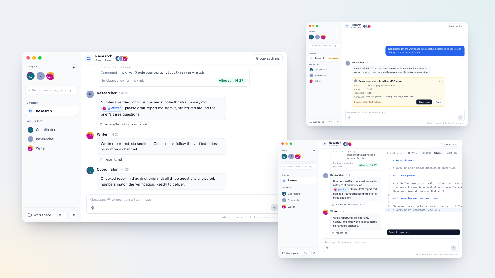

<p align="center">
  <picture>
    <source media="(prefers-color-scheme: dark)" srcset="docs/assets/readme-hero-dark.png">
    
  </picture>
</p>

<h1 align="center">Real Bot</h1>

<p align="center">Persistent AI teammates, organized by conversation, on your own Mac.</p>

<p align="center">
  <a href="https://blackman99.github.io/real-bot/"><b>Website</b></a> ·
  <a href="https://github.com/Blackman99/real-bot/releases/latest"><b>Download alpha</b></a> ·
  <a href="README.zh.md">简体中文</a>
</p>

<p align="center">
  <a href="https://github.com/Blackman99/real-bot/actions/workflows/ci.yml"></a>
  <a href="LICENSE"></a>
  
  <a href="https://github.com/Blackman99/real-bot/releases/latest"></a>
</p>

## What it does

- **Teammates, not throwaway chats.** Bots have names, duties and boundaries. They chat one to one, join groups, get `@`mentioned and hand work to each other. When one bot goes off to ask another, that is its own conversation, opened from the message that prompted it and read-only to you.
- **Everything stays on your Mac.** Window, daemon, sessions and one shared workspace folder are local. No project-run cloud.
- **Bring your own models and tools.** Any OpenAI-compatible endpoint; MCP servers over stdio or Streamable HTTP, available to every bot.
- **Model choice is made per turn, and says why.** Before each turn an agent picks the model and thinking level for that bot and leaves a one-line reason. When a correction runs its course it reviews what actually went wrong — the model, the task, or the way you asked — and only a verdict against the model is kept as that bot's experience. Every turn's choice, outcome and feedback reads back from the session itself, and the messenger log can be filtered.
- **Dangerous actions wait for you.** New endpoints or MCP servers, anything outside the workspace and outbound network stop at an approval card. Keys go to Keychain, never into chat.
- **Bots run the app.** Create bots, form groups and configure endpoints or MCP by talking to one.

## Get it

**Download** the latest alpha from [GitHub Releases](https://github.com/Blackman99/real-bot/releases/latest): unsigned `.dmg` for Apple silicon and Intel. The app carries its own runtime, so there is nothing else to install — no Bun, no Node, no checkout. If Gatekeeper blocks the first launch, right-click → Open, or run:

```bash
xattr -dr com.apple.quarantine "/Applications/Real Bot.app"
```

More detail: [Gatekeeper FAQ](docs/gatekeeper.md) · notarization path: [docs/notarization.md](docs/notarization.md) ([#10](https://github.com/Blackman99/real-bot/issues/10)).

**Updates:** the app checks GitHub Releases in the background and shows a dot on the settings gear when a newer build exists. Settings → General → About lists the current version and opens the matching `.dmg` in your browser; while builds are unsigned there is no in-app installer.

**Run from source** (macOS, Node 22+, pnpm 12.3.4, Bun 1.2+, Rust, Xcode Command Line Tools):

```bash
cd real-bot
pnpm install
pnpm dev
```

First run: pick a workspace folder (missing folders are created), add an OpenAI-compatible endpoint and key in Settings, create the first bot from the sidebar, then let it hire the rest.

## Status

Alpha, macOS only. What is live, in progress and out of scope: [website](https://blackman99.github.io/real-bot/en#boundaries) · [Roadmap](ROADMAP.md) · [CONTEXT.md](CONTEXT.md) (domain language).

## Contributing

[Development guide](docs/development.md) · [Contributing](CONTRIBUTING.md) · [Security](SECURITY.md). MIT licensed. Not affiliated with xAI / Grok.
