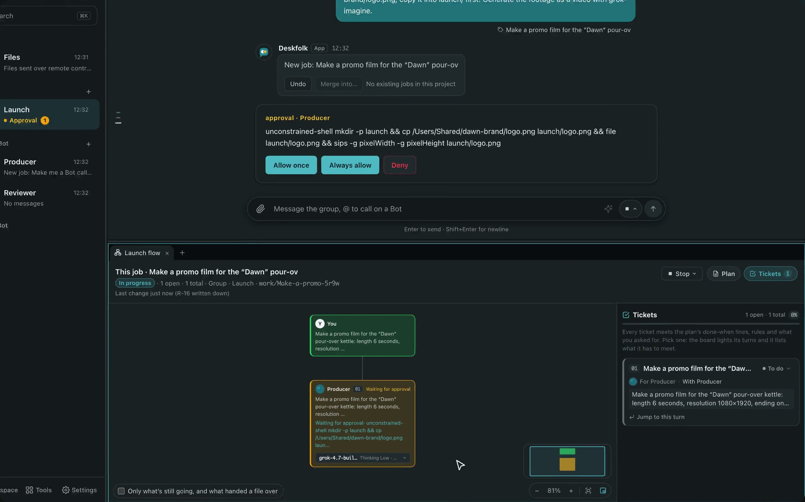
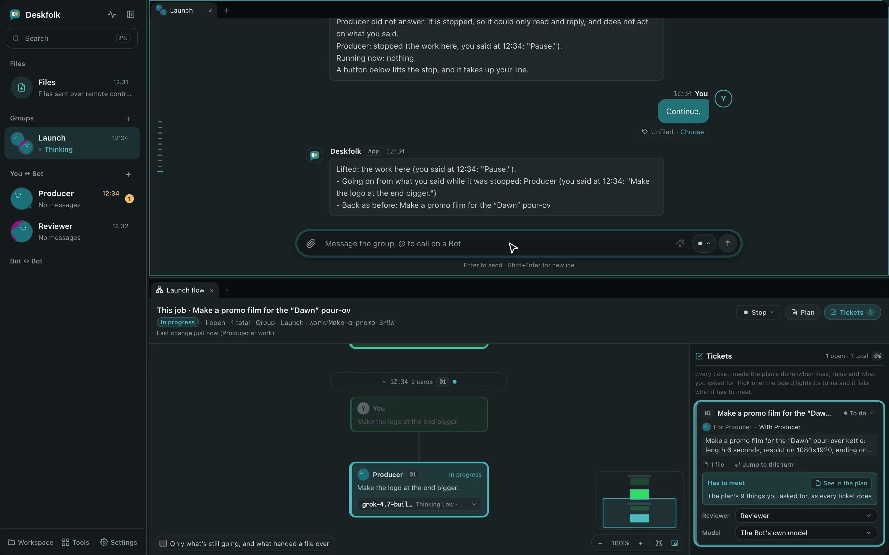
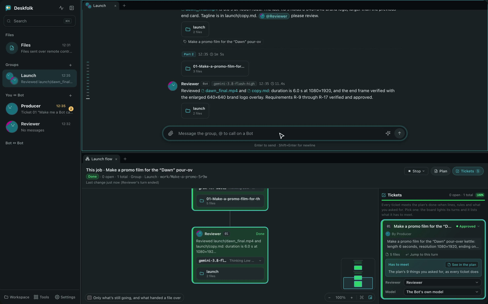
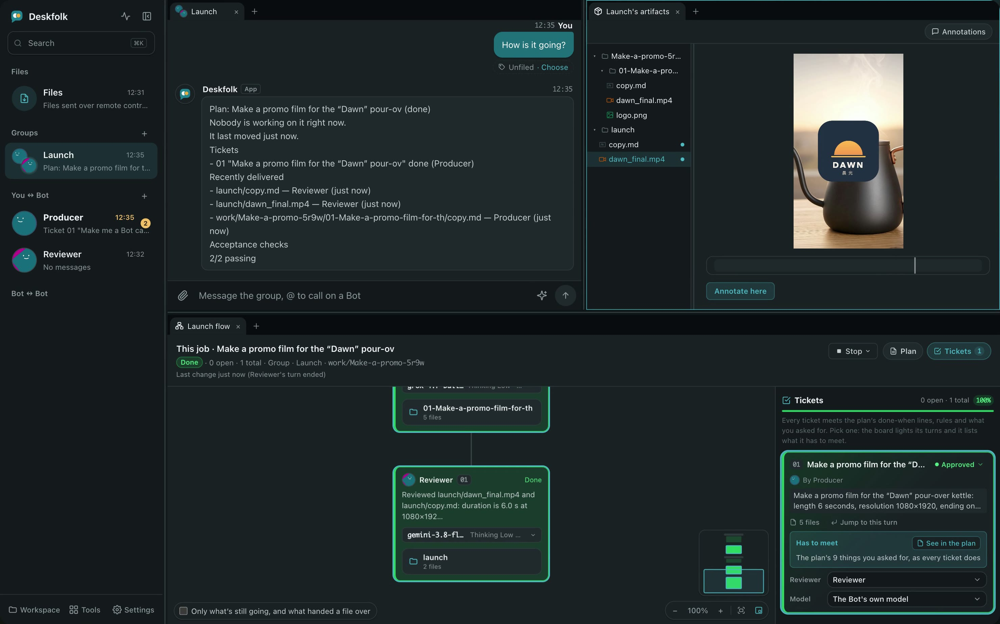

  
   
  Also in <a href="https://blackman99.github.io/deskfolk/media/deskfolk-mascots-zh.mp4">中文</a>

<h1 align="center">Deskfolk</h1>

Hand it off. Walk away. Return to results.

Multi-day, multi-step jobs that need rework go to Bots; when a Bot says done, the app checks first.

  <a href="https://blackman99.github.io/deskfolk/"><b>Website</b></a> ·
  <a href="https://github.com/Blackman99/deskfolk/releases/latest"><b>Download alpha</b></a> ·
  <a href="docs/overview.md"><b>About and install</b></a> ·
  <a href="README.zh.md">简体中文</a>

  
  
  
  

<table>
  <tr>
    <td width="50%"> Anything outside the workspace asks you first</td>
    <td width="50%"> Stop means stop, until you lift it</td>
  </tr>
  <tr>
    <td width="50%"> Done has a definition: checks, a review, your OK</td>
    <td width="50%"> Come back to results: chat, flow board and the work, side by side</td>
  </tr>
</table>

<a href="docs/overview.md">About and install</a> · <a href="ROADMAP.en.md">Roadmap</a> · <a href="docs/development.md">Development</a> · <a href="CONTRIBUTING.md">Contributing</a> · <a href="SECURITY.md">Security</a> · MIT

