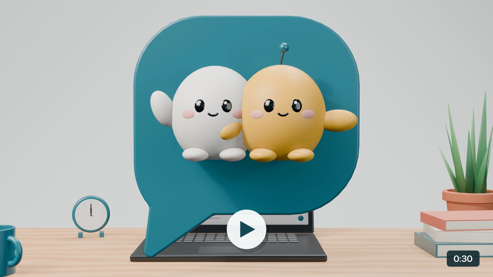

<p align="center">
  <a href="https://blackman99.github.io/deskfolk/media/deskfolk-mascots-en.mp4">
    
  </a>
  <br>
  <sub>Also in <a href="https://blackman99.github.io/deskfolk/media/deskfolk-mascots-zh.mp4">中文</a> · <a href="https://blackman99.github.io/deskfolk/media/deskfolk-promo-en.mp4">The full tour (1:26)</a></sub>
</p>

<h1 align="center">Deskfolk</h1>

<p align="center">Hand it off. Walk away. Return to results.</p>

<p align="center">Multi-day, multi-step jobs that need rework go to Bots; when a Bot says done, the app checks first.</p>

<p align="center">
  <a href="https://blackman99.github.io/deskfolk/"><b>Website</b></a> ·
  <a href="https://github.com/Blackman99/deskfolk/releases/latest"><b>Download alpha</b></a> ·
  <a href="README.zh.md">简体中文</a>
</p>

<p align="center">
  <a href="https://github.com/Blackman99/deskfolk/actions/workflows/ci.yml"></a>
  <a href="LICENSE"></a>
  
  <a href="https://github.com/Blackman99/deskfolk/releases/latest"></a>
</p>

## Why you can hand it over

The model does the work; the app holds it to account: where a job stands is decided by the app's own records, and what a Bot says only counts as a proposal. Each of the four points below came out of a real failure. They are rules in code, not prompts: you can change how Bots work (see *Make it work your way* below), but no prompt loosens them.

- **Nothing you ask for gets lost.** Every line you send is kept word for word in the same write that records it, and no Bot can write there; your requirements go into a requirements ledger one by one, and are only ever added to. The model tidying it can only propose patches, every quote has to be words you actually wrote, which the app checks, and a change is only a replacement waiting for your confirmation while the old one stays in force. Before this, your requirements lived on one list rewritten whole each time; across 70 revisions it dropped 15 rules, and "the robot arm is the left hand" and "about 2 minutes long" never came back.
- **Done has a definition.** A ticket moves only on a delivery, checks the daemon runs on your Mac, a review backed by evidence and your approval; with nobody to review, the app approves only when every check passes, and asks you when evidence is missing. A Bot writing "PASSED" moves nothing. Lines of the done-when that a machine can decide (a file exists, contains something, matches a pattern, a command succeeds, the parts several Bots made — chapters, images, shots — fit together) become checks, with the results on the flow board; you add them, or the app turns a command the job actually ran successfully into one, and Bots cannot write them. Before files are handed over, a "results to follow" needs a booked check-back or a named handoff, and a "tests pass" or "verified" needs a command that turn actually ran, or it goes back. Before this, a reviewer Bot passed a 107-second cut as "about 2 minutes", and you overturned five full-cut approvals. A large job — a whole episode, a book of many chapters — is laid out first: one part is the sample you approve, the others wait for it and are compared with it when handed in.
- **Stop is a state.** A stop is a record only you can lift, and starting a turn, waking a Bot and every tool call with side effects check it first; Stop ends a running turn at any time. Before this, after you said "hold on", the video director kept sending shots for review in two other direct chats, and a plan call-back had it hand in a new one.
- **Stalls get chased, without pestering you.** A supervisor looks every 15 seconds, calls no model and survives restarts: when a job goes quiet, it calls back the Bot holding the ball, and work a restart cut off picks itself up. The app comes to you only for your approval, for something only you can give, or when work has truly stopped; ask "how's it going" and it tells you what is waiting on you, who is on it, how far it got and which check fails, without waking or interrupting a Bot at work. Before this, a long job cut off by a restart sat for 7.6 hours with nobody knowing; then it swung the other way, with four cards in a day asking about default models.

## Who it's for

- **For** solo developers, technical individuals and small studios who can set up a model endpoint and API key themselves, with multi-day, multi-step work that needs rework and can't be watched all the time: a multi-episode AI video (shots, renders, review, rework), a daily news brief on a routine, a launch kit. One Bot on its own will do, and a team of Bots is for work that really splits; in the measurements below, one Bot finished small jobs as often as a team of three, for much less.
- **Not yet for** a one-off question or a job done in half an hour (one Bot is plenty, and lighter tools exist); several people sharing one setup, Linux, work that has to carry on while the Mac sleeps, or anyone who would rather not bring their own model endpoint. Windows is an experimental preview: each release carries an unsigned installer, and some features are not there yet — see [Get it](#get-it).

## Measured

Results of the golden-path benchmark, run on 2026-09-29, before the kernel ([ADR 0040](docs/adr/0040-agent-kernel-the-job-owns-state.md)) landed. Three fixed jobs: a research report, launch copy with a single-file landing page, and a command-line tool with tests. Each job runs unattended until it settles, with every approval denied. A judge model (claude-sonnet-4-6) grades it item by item against the task set's fixed done-when, plus deterministic checks on the delivered files, their content and commands. A job counts as done at 80% coverage with every check passing.

| Model | Team | Done | Cost per run | Approval cards per run |
|---|---|---|---|---|
| gemini-3.8-flash-high | three role Bots in a group | 9/9 | $0.55 | 0.3 |
| gemini-3.8-flash-high | one Bot on its own | 9/9 | $0.37 | 0.4 |
| grk-4.7-build-fast | three role Bots in a group | 6/6 | $2.31 | 2.8 |
| grk-4.7-build-fast | one Bot on its own | 4/6 | $0.74 | 0.8 |

grk on its own missed twice. One run timed out trying to check the landing page in a browser (Bots have no browser tool). In the other, the judge's answer could not be parsed, although the deliverable checks had all passed.

How to read it:
- One Bot can do these three kinds of job; a team of three does not finish them more often, and costs 1.5–3 times as much.
- In the 2026-09-28 baseline (45 runs) the gemini team finished only 7 of 9. The model sometimes sent back an empty reply, which ended the turn silently; that is fixed.
- Switching off the turn loop's side-calls (organizer, closing check, model pick, chain review, judgement, call-backs) finished no fewer jobs in 78 ablation runs, and switching all of them off was the fastest and cheapest; see [ADR 0037](docs/adr/0037-cut-the-core-loop-by-the-benchmark.md).
- The samples are small (6–9 runs per cell), so only large differences show, and they speak only for these three small kinds of job. Long jobs that stall halfway, large groups and choosing between several models are not covered yet.
- All three are small jobs, where the four points above have nothing to do; those came out of long jobs like multi-day video production. Measuring long jobs (injecting stops, complaints, restarts and rework, then counting side effects after a stop, rules lost and how often you were interrupted) is on the [roadmap](ROADMAP.en.md).

How to run it and read the results: [Development · golden-path benchmark](docs/development.md#黄金路径基准).

## What it does

- **Persistent teammates.** Bots have names, duties and boundaries; they chat one to one, join groups, get `@`mentioned and hand work to each other; a Bot that is mid-task is not cut off when a teammate `@`s it, and reads the line on its next step — as it does several lines you send in a row, or a line of yours you changed after sending it; a line not read yet can be taken back, or inserted to be read now. One Bot on its own will do; when the work splits, let it hire the rest.
- **It shows its work.** Every plan is a flow: the app files each message you send into a plan and its tickets, lists your requirements in the plan's spec, the same list as the requirements ledger, and draws the work as a card per turn by who woke whom, carrying the files that turn handed over, the ticket it worked in, and the model it ran on and why. You can open the direct chats Bots have with each other, too.
- **It asks before risky moves.** New endpoints or MCP servers, access outside the workspace and outbound network wait for your approval. What waits on you is marked on the conversation list, with macOS banners and a Dock badge.
- **The work and the files stay on your computer.** Window, daemon, sessions and the shared workspace are local, and keys go to the Keychain (Credential Manager on Windows). You bring the models and MCP servers: any OpenAI-compatible or Anthropic-compatible endpoint works, including Ollama or LM Studio on your own computer (see [Local models](#local-models)), and each turn's context goes to the endpoint you configured.
- **Or let your own Claude Code run a Bot.** Set a Bot to Claude Agent and each of its turns is run by the Claude Code you installed and signed in to, with its own tools, on the account it is signed in with (a Claude subscription or an API key); approvals, Stop, hand-overs and reviews work as for any Bot. The sidebar and the menu bar then show how much of your plan's 5-hour and 7-day windows is left, as your Claude Code reads it. With several Claude accounts on one computer, each Bot can run on the one you pick (by its Claude Code config directory). All of it can be set up from the paired phone too. The app never signs in to Claude or touches its credentials — [how it works](docs/behavior.en.md#claude-agent).
- **Make it work your way.** The System section and tool descriptions every Bot reads, and the app's own calls such as the organizer and the line readings, are prompts the app ships: change them in Settings → Prompts, restore the default at any time, and undo any change — or let a Bot propose one that you let through on its approval card. The answer formats code reads stay locked, and approvals and holds do not change with a prompt — [how it works](docs/behavior.en.md#built-in-prompt).
- **Bots argue from the records.** Ask a Bot which kind of work keeps coming back, or which prompt to change, and it reads what the app keeps on this computer (conversations, turns, the requirements ledger, spend, work events…) and the daemon's log, read-only, and proposes changes from what it finds — only when you ask. Remote access's keys, push settings and your terminals stay out of its reach — [how it works](docs/behavior.en.md#records).
- **Bots look back after a delivery.** Once a job you accepted is delivered, each Bot that handed something over in it and had something go wrong reads the job's record, finds where it tripped up, which of its ways made you send work back and what to do again, and works that into its own memories and skills: the same subject overwritten, two about one thing merged, a wrong one corrected, so they don't just pile up. It posts nothing and asks you nothing; the trace's Plan view lists it under Retrospective, with an undo for each change — [how it works](docs/behavior.en.md#learning).
- **Office file previews.** Open `.docx`, `.xlsx` and `.pptx` from chat files, the workspace or flow-board outputs. Read documents, switch worksheets and browse slides locally, with full-window viewing and Escape or phone Back to return to the preview; [format support and limits](docs/development.md#办公文件预览).
- **Speak instead of typing.** Set up a speech service under Settings → Models → Speech recognition — OpenAI, Groq, SiliconFlow, Alibaba Bailian (pay-as-you-go or Token Plan, which can reuse a Bailian endpoint's key), Xiaomi MiMo (any plan, reusing a MiMo endpoint's key the same way), Deepgram, ElevenLabs, or any address in one of their formats, a local Whisper server included — and a microphone appears beside the message box, on the computer and the phone: what you say becomes text in the box, for you to read over before sending. The recording goes through this computer to that service and is not kept — [ADR 0073](docs/adr/0073-speech-recognition.md).
- **Annotate what a Bot hands over.** Mark a spot in text or code, rendered Markdown, an image or PDF region, an HTML element or a moment of audio or video; the batch goes out as one reply the Bot works through and resolves note by note.
- **Models by rule, stepping up when stuck.** Each Bot has a default model, the one it used most over the last 7 days, or one you pin; work that needs to see images skips models marked as unable to. When the same job keeps failing or a turn keeps erring, it thinks one level harder, then climbs the ladder of models you order in Settings → Models — Claude models run by your own Claude Code included (a pinned model stays put). Each turn's card on the flow board says which model it ran on and why. What went wrong is filed by type, without asking a model whether the model fell short; a command that times out again and again, like a search of the whole disk, gets a warning and then a block from the app before the next call.
- **A split-pane workbench.** Divide the desktop window into panes of conversations, terminals, the routine calendar, workspace and Spend; where each kind of window opens (a new tab, in place, split some way, the pane beside, floating) is set in Settings → Behavior → Where windows open — by default a conversation replaces the one in front, artifacts and the job's views open on the right, terminals below. Drag a tab along its strip to reorder it; right-click a tab to close it, the other tabs, the tabs to its right, or all of them. Close an empty pane with its top-right ×, or choose **Close pane** from a pane’s context menu. In the workspace file tree, ⌘-click or Shift-click picks several files and folders; right-click moves them to the Mac’s Trash, where Finder can put them back, or drag them onto the composer to attach them to your next message by path, with nothing copied. Fold the session list to a rail of avatars with the last button in its search row or ⌘B; the pulse button before it (on a phone, right of the search field; on the rail, under search) shows only the conversations a Bot is working in, counting those waiting on your approval or answer.
- **Global search.** Open Search from the sidebar or folded rail, or press ⌘K (Ctrl+K). Filter conversations, messages, files and routines in a keyboard-friendly dialog; phones use a full-screen view. In the editor or terminal, use ⌘⇧K (Ctrl+Shift+K). Rail icons explain themselves on hover or keyboard focus.
- **Your own terminal.** Shells held by the daemon keep running when the window closes; while a Bot works, its message shows what it has said so far, the commands it has finished folded into a line that opens onto a card (each one's output too, coloured like code), which stays under its reply once it is done, and at the end the step it is on — the file it is reading, the command it is running — with how long the turn has taken; the step opens onto what is printing right now.
- **Spend by model, conversation and Bot.** Track turn, decision and feedback calls; reported amounts and estimates stay separate — [spend and billing rates](docs/spend.md).
- **Routines.** Bots start work daily or weekly on the local clock of the computer they run on — [how routines work](docs/routines.md).
- **From your phone — experimental, off by default.** Reach your Mac through a relay you run yourself, end-to-end encrypted — [remote access](docs/remote-access.md). With Screen Sharing on at the Mac (a VNC server on Windows), you can also see and operate its screen from the phone, lock screen included.

## Get it

macOS 13 (Ventura) or later, Apple silicon or Intel. Windows x64 is an experimental preview (see below); Linux is not yet supported.

- **Download** the latest unsigned `.dmg` from [Releases](https://github.com/Blackman99/deskfolk/releases/latest); nothing else to install. If Gatekeeper blocks the first launch, right-click → Open, or run `xattr -dr com.apple.quarantine "/Applications/Deskfolk.app"` ([Gatekeeper FAQ](docs/gatekeeper.md)). On Windows, run `Deskfolk_<version>_x64-setup.exe` from the same release: it installs for the current user without admin rights, and as it is unsigned, SmartScreen warns about an unknown publisher (More info → Run anyway).
- **Updates** show as a dot on the labeled **Settings** entry at the bottom of the desktop sidebar; Settings → About downloads and installs them (on Windows, About opens the download in the browser for now). Appearance is in Settings → General → Appearance.
- **From source** on macOS (Node 22+, pnpm 12.3.4, Bun 1.2+, Rust, Xcode Command Line Tools):

```bash
git clone https://github.com/Blackman99/deskfolk.git
cd deskfolk
pnpm install
pnpm dev
```

- **From source on Windows:** the same `git clone` / `pnpm install` / `pnpm dev`, with Rust's MSVC toolchain and Visual Studio Build Tools ("Desktop development with C++") in place of Xcode, plus a one-time `cargo build --manifest-path apps/conpty-helper/Cargo.toml` for the terminal helper. Install Git for Windows as well: Bots' shell tool runs commands in Git Bash when it finds one, and in PowerShell otherwise. `pnpm --filter @real-bot/desktop tauri build --bundles nsis` builds the installer locally.
- **Not on Windows yet:** the independent runtime, installing an update inside the app, desktop notifications and the badge, and image thumbnails. Data lives in `%LOCALAPPDATA%\real-bot` and keys in Windows Credential Manager; installing it and how it differs are in [Windows preview](docs/windows.md), prerequisites and packaging in the [development guide](docs/development.md#windows实验性).

For long jobs on a source build (a multi-shot video, say), run `pnpm dev:steady` instead of `pnpm dev`: the daemon does not restart when the code changes or you `git pull`, so turns in progress are not interrupted.

First run: the setup wizard walks you through picking a workspace folder, adding an endpoint and key, and creating the first Bot; then let it hire the rest. Anthropic, Xiaomi MiMo and Qwen (Alibaba Cloud Model Studio) are built in: pick one and paste a key, and the app finds which of the vendor's plans it belongs to. A personal Anthropic key not scoped to a workspace also needs the workspace ID (`wrkspc_…`, from Console → Settings → Workspaces); see [ADR 0072](docs/adr/0072-built-in-connectors.md).

### Local models

Ollama, LM Studio and llama.cpp's `llama-server` all work as endpoints: pick the preset in the wizard, or add one under Settings → Models (an address such as `http://localhost:11434/v1`). An address on this computer or your network needs no key, and the model list and each model's context window are read from the server. Worth knowing first:

- **The context has to be large.** A Bot's step is often 20–90K tokens; the persona, instructions and tool definitions alone come to over 10K. Raise the server's context to 64K or more: on Ollama set `OLLAMA_CONTEXT_LENGTH=65536` (or `PARAMETER num_ctx 65536` in a Modelfile), in LM Studio set Context Length when loading the model, in llama.cpp pass `-c 65536`. When a long turn nears the window, its earlier work is condensed into a summary and it carries on; when even the instructions, conversation and tool definitions do not fit, the turn stops and says how big the step was and how big the window is, instead of answering from a prompt with its start cut off.
- **The model has to call tools.** A Bot's work is all tool calls. **Test** in a model's attributes shows its tokens per second, the time to its first token and whether it calls a tool it is given; a model the server says cannot call tools is tagged "No tools" in the list.
- **Mixing works better.** The readings of your lines and the planning calls run on the default model unless you choose others, and a local server that handles one request at a time puts them behind the step a Bot is writing. Keep the default endpoint and model on a cloud model and pin Bots to the local one in their profiles, or, under Settings → Models → **Built-in models**, move just **Reading** and the **Organizer** to a cloud model (the organizer wants a strong one).
- **Local is much slower.** An 8B model writes about 30 tokens a second on an M4 Pro. Local endpoints get longer time limits (up to 15 minutes for the first token), and how long a step may write follows the measured speed. Details in [ADR 0067](docs/adr/0067-local-model-servers.md).

## Status

Alpha; macOS is the primary target and features and data formats may still change there too. Windows is a fresh, experimental preview — expect rough edges and missing features (see [Get it](#get-it)). Linux is not yet supported. Remote access is a default-off prototype (on Windows not yet tried on a real PC). Everyday use and Web Push work on a real Android phone in Chrome; the iOS home screen and WebAuthn user verification have not been checked on real devices, and the independent security review has not passed. The installed app can pair: it keeps the Mac's remote identity in a private file rather than the Keychain and approves each device with Touch ID, or Windows Hello on Windows ([ADR 0033](docs/adr/0033-remote-credentials-in-a-file.md), [ADR 0059](docs/adr/0059-windows-remote-access-and-screen.md)).

[What is live and what is not](https://blackman99.github.io/deskfolk/en#boundaries) · [Roadmap](ROADMAP.en.md) · [Domain language](CONTEXT.en.md) · [Relay deployment](docs/deploy-remote.md)

## Contributing

[Development guide](docs/development.md) · [Contributing](CONTRIBUTING.md) · [Security](SECURITY.md). MIT licensed. Not affiliated with xAI / Grok.
