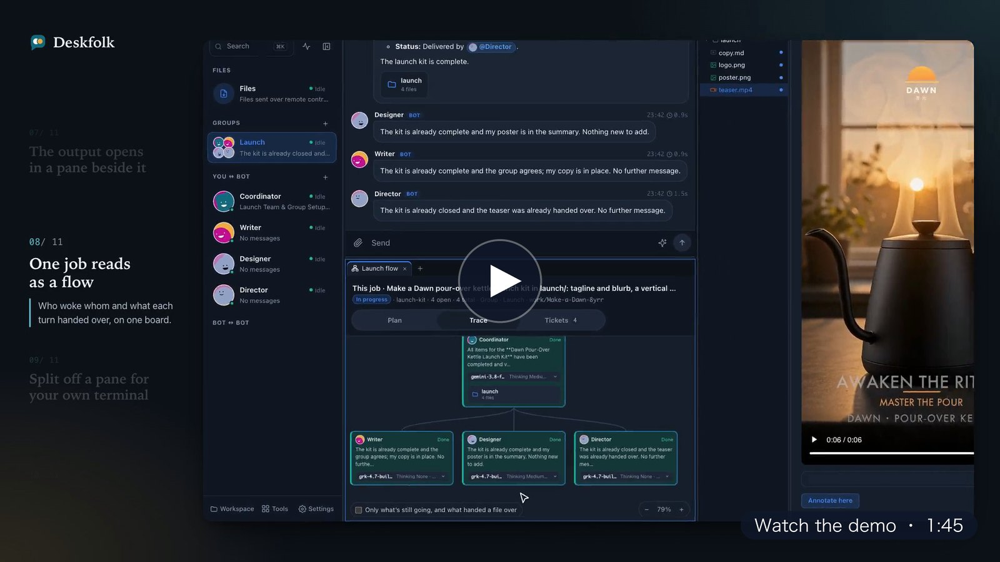

<p align="center">
  <a href="https://blackman99.github.io/deskfolk/media/deskfolk-promo-en.mp4">
    
  </a>
  <br>
  <sub>Also in <a href="https://blackman99.github.io/deskfolk/media/deskfolk-promo-zh.mp4">中文</a></sub>
</p>

<h1 align="center">Deskfolk</h1>

<p align="center">Hand it to Bots that see it through.</p>

<p align="center">Bots split the work and hand it on; stalls get chased, unverified claims get called out, and every step is on record.</p>

<p align="center">
  <a href="https://blackman99.github.io/deskfolk/"><b>Website</b></a> ·
  <a href="https://github.com/Blackman99/deskfolk/releases/latest"><b>Download alpha</b></a> ·
  <a href="README.zh.md">简体中文</a>
</p>

<p align="center">
  <a href="https://github.com/Blackman99/deskfolk/actions/workflows/ci.yml"></a>
  <a href="LICENSE"></a>
  
  <a href="https://github.com/Blackman99/deskfolk/releases/latest"></a>
</p>

## Why you can hand it over

- **It checks before handing over.** Before a Bot hands you files, the app checks three definite things: whether the job's acceptance checks pass (see the next point), whether a "results to follow" is backed by a check-back or a named handoff, and whether a "tests pass" or "verified" is backed by a command that turn actually ran; if one is missing, it goes back to be fixed, accounted for, or marked as not verified.
- **The done-when can be checked by the app itself.** Lines of a plan's done-when that a machine can decide (a file exists, contains something, matches a pattern, a command succeeds, the parts several Bots made — chapters, images, shots — fit together) can carry a check the daemon runs on your Mac, with the result on the flow board. While a check fails, the organizer will not call the job done, and when it stops, the app calls a Bot back once with the failing checks. You add checks; the organizer can also turn a command the job actually ran successfully into one; Bots cannot write them.
- **A job that stalls gets noticed.** Tickets on the flow board move with the work; when a job goes quiet with tickets still open, the app calls the Bot on it back once, and tells you if nothing moves. Ask "how's it going" and the app itself tells you what is waiting on you, who is on it, how far it got, who is coming back to check and whether the checks pass, however many Bots split the work, without waking or interrupting a Bot at work.
- **Large jobs are laid out first, with a sample.** The app recognises a large job — a whole episode, a book of many chapters — and has the lead lay it out in parts with one marked as the sample; until then nothing is generated or handed over. You approve the sample, its card saying what it took and what the rest would; the other parts wait for it, and each is compared with it when handed over and sent back if it falls short.
- **It shows its work.** Every plan is a flow: the app files each message you send into a plan and its tickets, keeps the goal, the done-when and your rules as the plan's spec, and draws the work as a card per turn by who woke whom, carrying the files that turn handed over, the ticket it worked in, and the model it ran on and why. You can open the direct chats Bots have with each other, too.
- **It asks before risky moves.** New endpoints or MCP servers, access outside the workspace and outbound network wait for your approval. What waits on you is marked on the conversation list, with macOS banners and a Dock badge. Stop ends a running turn in a direct chat at any time.
- **The work and the files stay on your computer.** Window, daemon, sessions and the shared workspace are local, and keys go to the Keychain (Credential Manager on Windows). You bring the models and MCP servers: any OpenAI-compatible endpoint works, and each turn's context goes to the endpoint you configured.

## Who it's for

- **For** solo developers, technical individuals and small studios who can set up a model endpoint and API key themselves, with a job that needs a few roles and several file-producing steps: a research report, a launch kit, a small tool with tests and a start command.
- **Not yet for** several people sharing one setup, Linux, work that has to carry on while the Mac sleeps, or anyone who would rather not bring their own model endpoint. Windows is an experimental preview: each release carries an unsigned installer, and some features are not there yet — see [Get it](#get-it).

## Measured

Results of the golden-path benchmark on the current code, 2026-09-29. Three fixed jobs: a research report, launch copy with a single-file landing page, and a command-line tool with tests. Each job runs unattended until it settles, with every approval denied. A judge model (claude-sonnet-4-6) grades it item by item against the task set's fixed done-when, plus deterministic checks on the delivered files, their content and commands. A job counts as done at 80% coverage with every check passing.

| Model | Team | Done | Cost per run | Approval cards per run |
|---|---|---|---|---|
| gemini-3.8-flash-high | three role Bots in a group | 9/9 | $0.55 | 0.3 |
| gemini-3.8-flash-high | one Bot on its own | 9/9 | $0.37 | 0.4 |
| grk-4.7-build-fast | three role Bots in a group | 6/6 | $2.31 | 2.8 |
| grk-4.7-build-fast | one Bot on its own | 4/6 | $0.74 | 0.8 |

grk on its own missed twice. One run timed out trying to check the landing page in a browser (Bots have no browser tool). In the other, the judge's answer could not be parsed, although the deliverable checks had all passed.

How to read it:
- One Bot can do these three kinds of job; a team of three does not finish them more often, and costs 1.5–3 times as much.
- In the 2026-09-28 baseline (45 runs) the gemini team finished only 7 of 9. The model sometimes sent back an empty reply, which ended the turn silently; that is fixed.
- Switching off the turn loop's side-calls (organizer, closing check, model pick, chain review, judgement, call-backs) finished no fewer jobs in 78 ablation runs, and switching all of them off was the fastest and cheapest; see [ADR 0037](docs/adr/0037-cut-the-core-loop-by-the-benchmark.md).
- The samples are small (6–9 runs per cell), so only large differences show, and they speak only for these three small kinds of job. Long jobs that stall halfway, large groups and choosing between several models are not covered yet.

How to run it and read the results: [Development · golden-path benchmark](docs/development.md#黄金路径基准).

## What it does

- **Persistent teammates.** Bots have names, duties and boundaries; they chat one to one, join groups, get `@`mentioned and hand work to each other; a Bot that is mid-task is not cut off when a teammate `@`s it, and reads the line on its next step.
- **Office file previews.** Open `.docx`, `.xlsx` and `.pptx` from chat files, the workspace or flow-board outputs. Read documents, switch worksheets and browse slides locally, with full-window viewing and Escape or phone Back to return to the preview; [format support and limits](docs/development.md#办公文件预览).
- **Annotate what a Bot hands over.** Mark a spot in text or code, rendered Markdown, an image or PDF region, an HTML element or a moment of audio or video; the batch goes out as one reply the Bot works through and resolves note by note.
- **Model choice that says why.** An agent picks each turn's model and thinking level and leaves a reason; only reviews that blame the model become the Bot's experience.
- **A split-pane workbench.** Divide the desktop window into panes of conversations, terminals, the routine calendar, workspace and Spend. Drag a tab along its strip to reorder it; right-click a tab to close it, the other tabs, the tabs to its right, or all of them. Close an empty pane with its top-right ×, or choose **Close pane** from a pane’s context menu. In the workspace file tree, ⌘-click or Shift-click picks several files and folders; right-click moves them to the Mac’s Trash, where Finder can put them back, or drag them onto the composer to attach them to your next message by path, with nothing copied. Fold the session list to a rail of avatars with the last button in its search row or ⌘B; the pulse button before it (on a phone, right of the search field; on the rail, under search) shows only the conversations a Bot is working in, counting those waiting on your approval or answer.
- **Global search.** Open Search from the sidebar or folded rail, or press ⌘K (Ctrl+K). Filter conversations, messages, files and routines in a keyboard-friendly dialog; phones use a full-screen view. In the editor or terminal, use ⌘⇧K (Ctrl+Shift+K). Rail icons explain themselves on hover or keyboard focus.
- **Your own terminal.** Shells held by the daemon keep running when the window closes; a Bot's commands scroll under its message while they run, and before it starts writing, its "Thinking" line names the file it is reading or the command it is running, and opens into every step the turn has taken.
- **Spend by model, conversation and Bot.** Track turn, decision and feedback calls; reported amounts and estimates stay separate — [spend and billing rates](docs/spend.md).
- **Routines.** Bots start work daily or weekly on the local clock of the computer they run on — [how routines work](docs/routines.md).
- **From your phone — experimental, off by default.** Reach your Mac through a relay you run yourself, end-to-end encrypted — [remote access](docs/remote-access.md). With Screen Sharing on at the Mac, you can also see and operate its screen from the phone, lock screen included.

## Get it

macOS 13 (Ventura) or later, Apple silicon or Intel. Windows x64 is an experimental preview (see below); Linux is not yet supported.

- **Download** the latest unsigned `.dmg` from [Releases](https://github.com/Blackman99/deskfolk/releases/latest); nothing else to install. If Gatekeeper blocks the first launch, right-click → Open, or run `xattr -dr com.apple.quarantine "/Applications/Deskfolk.app"` ([Gatekeeper FAQ](docs/gatekeeper.md)). On Windows, run `Deskfolk_<version>_x64-setup.exe` from the same release: it installs for the current user without admin rights, and as it is unsigned, SmartScreen warns about an unknown publisher (More info → Run anyway).
- **Updates** show as a dot on the labeled **Settings** entry at the bottom of the desktop sidebar; Settings → About downloads and installs them (on Windows, About opens the download in the browser for now). Appearance is in Settings → General → Appearance.
- **From source** on macOS (Node 22+, pnpm 12.3.4, Bun 1.2+, Rust, Xcode Command Line Tools):

```bash
git clone https://github.com/Blackman99/deskfolk.git
cd deskfolk
pnpm install
pnpm dev
```

- **From source on Windows:** the same `git clone` / `pnpm install` / `pnpm dev`, with Rust's MSVC toolchain and Visual Studio Build Tools ("Desktop development with C++") in place of Xcode, plus a one-time `cargo build --manifest-path apps/conpty-helper/Cargo.toml` for the terminal helper. Install Git for Windows as well: Bots' shell tool runs commands in Git Bash when it finds one, and in PowerShell otherwise. `pnpm --filter @real-bot/desktop tauri build --bundles nsis` builds the installer locally.
- **Not on Windows yet:** remote access and phone pairing, the independent runtime, installing an update inside the app, desktop notifications and the badge, and image thumbnails. Data lives in `%LOCALAPPDATA%\real-bot` and keys in Windows Credential Manager; installing it and how it differs are in [Windows preview](docs/windows.md), prerequisites and packaging in the [development guide](docs/development.md#windows实验性).

For long jobs on a source build (a multi-shot video, say), run `pnpm dev:steady` instead of `pnpm dev`: the daemon does not restart when the code changes or you `git pull`, so turns in progress are not interrupted.

First run: the setup wizard walks you through picking a workspace folder, adding an endpoint and key, and creating the first Bot; then let it hire the rest.

## Status

Alpha; macOS is the primary target and features and data formats may still change there too. Windows is a fresh, experimental preview — expect rough edges and missing features (see [Get it](#get-it)). Linux is not yet supported. Remote access is a default-off prototype, on macOS only. Everyday use and Web Push work on a real Android phone in Chrome; the iOS home screen and WebAuthn user verification have not been checked on real devices, and the independent security review has not passed. The installed app can pair: it keeps the Mac's remote identity in a private file rather than the Keychain and approves each device with Touch ID ([ADR 0033](docs/adr/0033-remote-credentials-in-a-file.md)).

[What is live and what is not](https://blackman99.github.io/deskfolk/en#boundaries) · [Roadmap](ROADMAP.en.md) · [Domain language](CONTEXT.en.md) · [Relay deployment](docs/deploy-remote.md)

## Contributing

[Development guide](docs/development.md) · [Contributing](CONTRIBUTING.md) · [Security](SECURITY.md). MIT licensed. Not affiliated with xAI / Grok.
