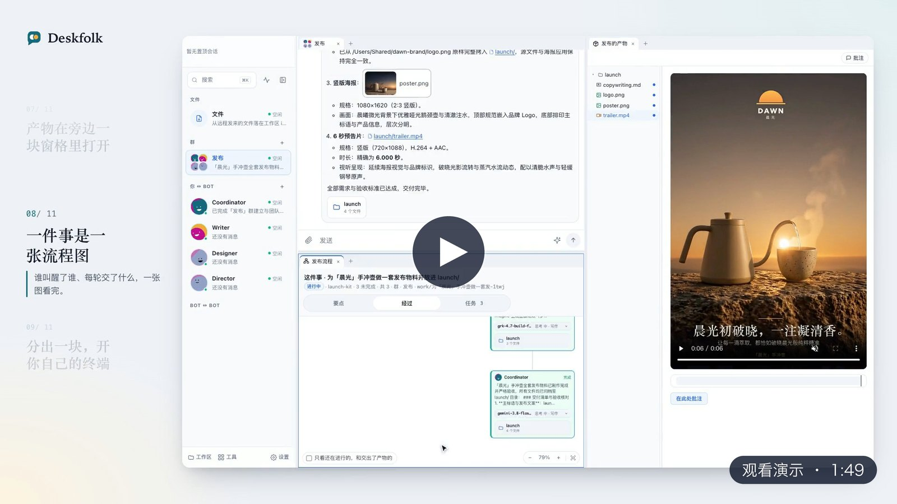

<p align="center">
  <a href="https://blackman99.github.io/deskfolk/media/deskfolk-promo-zh.mp4">
    
  </a>
  <br>
  <sub>另有 <a href="https://blackman99.github.io/deskfolk/media/deskfolk-promo-en.mp4">English</a> 版</sub>
</p>

<h1 align="center">Deskfolk</h1>

<p align="center">交出去，离开，回来看结果。</p>

<p align="center">多天、多步、要返工的活交给 Bot；Bot 说做完的，应用先核过。</p>

<p align="center">
  <a href="https://blackman99.github.io/deskfolk/zh"><b>官网</b></a> ·
  <a href="https://github.com/Blackman99/deskfolk/releases/latest"><b>下载 Alpha</b></a> ·
  <a href="README.md">English</a>
</p>

<p align="center">
  <a href="https://github.com/Blackman99/deskfolk/actions/workflows/ci.yml"></a>
  <a href="LICENSE"></a>
  
  <a href="https://github.com/Blackman99/deskfolk/releases/latest"></a>
</p>

## 为什么放心交给它

模型负责干活，应用负责当真：一件事走到哪一步，只由应用自己的记录说了算，Bot 说的话只算提议。下面四条，每条都来自一次真实的翻车。

- **你的要求不会丢。** 你说的每句话在记下它的同一步原样另存一份，Bot 写不了；你的要求一条一条记进需求台账，只增不删。整理时模型只能提补丁，引文必须是你原话里的字，由应用核对；要改一条只出待你确认的替代，旧的照样生效。以前要求记在一份每次整份重写的单子上，70 版修订里丢过 15 条规则，「机械臂是左手」「片长约 2 分钟」丢了就再没回来。
- **做完有定义。** 任务只由交付、守护进程在本机跑的检查、有依据的审查和你的放行往前推；没人审时，检查都过了应用才放行，缺依据就问你。Bot 说一句「PASSED」什么都不动。验收里能机器判定的那几条（文件在不在、写没写到、正则对不对、一条命令跑不跑得通，几个 Bot 分头做的章节、图片、镜头接在一起连不连贯）挂成检查，结果标在流程图上；检查由你加，或由应用从这件事真跑成功过的命令里提，Bot 自己写不了。交文件之前，说了「随后给」要约好回看或点名交给谁，说了「测试通过」「验证过」这一轮得真跑过命令，不然退回去。以前审片员 Bot 把一条 107 秒的成片当成「约 2 分钟」放行，五次整片放行都被你推翻。一整集视频、很多章的书这类大活先拆再做：其中一件是你放行的样片，其余各件等它，交上来时拿它对照。
- **停下是状态。** 叫停是一条只有你能解除的记录，开轮、叫醒和有副作用的工具调用都要先过它；进行中的一轮随时能 Stop。以前你说了「停一下」，视频导演还在另外两条私聊里接着送审，规划叫回又让它交了一个新镜头。
- **停在半路有人追，也不烦你。** 监督器每 15 秒看一遍，不调模型，重启不丢：一件事静下来，它叫回球在谁手里的那个 Bot；重启打断的活自己接着做。应用只在要你放行、要只有你给得了的东西、或者活真停住时才找你；问一句「怎么样了」，它直接告诉你有什么在等你、谁在做、做到哪、哪条检查没过，不叫醒也不打断正在干活的 Bot。以前重启打断的长活停了 7.6 小时没人知道；后来又走到另一头，一天来了四张问默认模型的卡片。

## 适合谁

- **适合**：会自己配模型端点和 API key 的独立开发者、技术型个人和小工作室，手上有多天、多步、要返工、人又不能一直盯着的活，比如多集 AI 视频（镜头、渲染、审片、返工）、每天定点出的新闻简报、一套发布物料。一个 Bot 单干也行，几个 Bot 分工留给真要分工的活：下面的实测里，小活单干和三人团队做完得一样多，花费低得多。
- **暂不适合**：一次问答、半小时就能做完的小活（一个 Bot 就够，也有更轻的工具）；几个人共用一套、要 Linux、要 Mac 睡眠时也接着干活，或者不想自己接模型端点。Windows 有一条刚起步的实验性预览：每个 Release 都带未签名安装包，有些功能还没有——见下方「获取」。

## 实测

2026-09-29 用黄金路径基准跑的结果，那时内核（[ADR 0040](docs/adr/0040-agent-kernel-the-job-owns-state.md)）还没落地。三件固定的事：一份调研报告、一套上线文案加单文件落地页、一个带测试的命令行小工具。每件事无人值守跑到静下来，批准一律拒绝；按任务集里固定的验收，让评判模型（claude-sonnet-4-6）逐条判，外加交付文件、内容和命令的确定性检查，覆盖率到 80% 且检查全过才算做完。

| 模型 | 组队 | 做完 | 每次花费 | 每次批准卡 |
|---|---|---|---|---|
| gemini-3.8-flash-high | 三个角色 Bot 开群 | 9/9 | $0.55 | 0.3 |
| gemini-3.8-flash-high | 一个 Bot 单干 | 9/9 | $0.37 | 0.4 |
| grk-4.7-build-fast | 三个角色 Bot 开群 | 6/6 | $2.31 | 2.8 |
| grk-4.7-build-fast | 一个 Bot 单干 | 4/6 | $0.74 | 0.8 |

grk 单干没做完的两次：一次为了在浏览器里核对落地页而超时（Bot 没有浏览器工具），一次是评判的答案没能解析，而交付检查其实全过了。

读法：
- 这三类活一个 Bot 就能做完，三人团队没有更常做完，花费却是它的 1.5–3 倍。
- 2026-09-28 的基线（45 次）里，gemini 的团队只做完 7/9，原因是模型有时回一条空回复，这一轮就悄悄结束了；这个问题已经修掉。
- 关掉轮次里的旁路调用（整理跳、收尾自检、选路、复盘、参与判断、叫回），78 次消融里没有一种让做完的次数变少，全关反而最快、最便宜，见 [ADR 0037](docs/adr/0037-cut-the-core-loop-by-the-benchmark.md)。
- 样本很小，每格 6–9 次，只能看出大的差别，而且只说明这三类小活；会在半路停下的长活、大群、多模型挑选，这个基准还没覆盖。
- 这三件都是小活，用不上上面那四条保证；那四条是在多天的视频制作这种长活里磨出来的。长活的实测（注入叫停、投诉、重启和返工，量叫停之后还有没有副作用、规则丢没丢、打扰了你几次）排在[路线图](ROADMAP.md)上。

跑法和怎么读结果见[开发说明·黄金路径基准](docs/development.md#黄金路径基准)。

## 它做什么

- **持久的队友。** Bot 有名字、职责和边界，可以私聊、进群、被 `@` 点名、彼此交接；正在干活的 Bot 被队友 `@` 时不会被打断，下一步就读到这句话；你连着发几句、或改了一句已经发出去的话，它也在下一步读到。一个 Bot 单干也行，要分工时再让它把队友建出来。
- **做了什么都看得见。** 一个规划一张流程图：你发的每条消息由应用归到规划和任务，你的要求列在要点里，和需求台账是同一张单子；经过按谁叫醒了谁画出来，一轮一张卡片，交出的文件、干的任务、用的模型和原因都挂在卡片上。Bot 之间的私聊你也能打开看。
- **危险动作先问你。** 新建端点或 MCP、工作区外读写和出站网络都要你批准；等你的事标在会话列表上，配合 macOS 横幅和 Dock 角标。
- **执行和文件在你自己的电脑上。** 窗口、守护进程、会话和共享工作区都在本机，密钥进钥匙串（Windows 上是凭据管理器）。模型和 MCP 服务器由你接：任意 OpenAI 兼容端点都行，每一轮的上下文发给你配置的那个端点。
- **也可以让你自己的 Claude Code 来跑一个 Bot。** 把 Bot 的运行方式设成 Claude Agent，它的每一轮就由你本机安装并登录的 Claude Code 用它自己的工具来跑，用量记在它登录的账号上（Claude 订阅或 API key）；批准、Stop、交付和审查和别的 Bot 一样。应用不登录 Claude、不碰它的凭据——[怎么用](docs/behavior.md#claude-agent)。
- **改成你自己的工作方式。** Bot 每一轮读的系统指令和工具说明，以及整理、读句这些应用自己的调用，都是应用自带的提示词：在 设置 → 提示词 里能改、能恢复默认，每次修改都能撤销；也可以让 Bot 提改动，在批准卡上由你放行。代码要读的输出格式锁着，批准、叫停这些规矩不随提示词变——[怎么用](docs/behavior.md#built-in-prompt)。
- **办公文件预览。** 聊天文件、工作区与流程图产物可直接打开 `.docx`、`.xlsx`、`.pptx`，本地只读查看文档、切换工作表与翻阅幻灯片，支持全屏查看，Esc 或手机返回先退出全屏；[格式支持与限制](docs/development.md#办公文件预览)。
- **在交付物上直接批注。** 文字或代码、Markdown 渲染态、图片或 PDF 上的一块、HTML 元素、音视频的一个时间点都能批；攒一批发出去是一条回复，Bot 逐条改完逐条标掉。
- **模型按规则定，卡住了自己提档。** 每个 Bot 有默认模型，按它最近 7 天用得最多的定，也可以给它钉一个；要看图的活不落到标着看不了图的模型上。同一件活连着没过、或一轮里接连出错，先提一档思考，还不行再沿你在 设置 → 模型 里排的阶梯换更强的模型（钉的不换）。每轮跑在哪个模型上、为什么，写在流程图那一轮的卡片上。出过的错按类型记下，不再事后调模型复盘；全盘搜索那种一超时再超时的命令，应用在下一次调用前先警告、再拦下。
- **可分屏的工作台。** 桌面窗口可以分成多块窗格，放会话、终端、日程图、工作区和花费。沿标签栏拖动标签页可调整顺序；右键标签页可关闭它、其他标签页、右侧标签页或所有标签页。空窗格可点右上角 × 关闭，也可在窗格右键菜单选择「关闭窗格」。工作区文件树里 ⌘ 点击或 Shift 点击可多选文件和文件夹，右键即可移到 Mac 的废纸篓，在 Finder 里还能放回；也能直接拖进聊天框，随下一条消息作为附件发出，挂的是原路径，不复制。搜索行最右边的按钮或 ⌘B 可把会话列表收成只有头像的窄栏；它左边的脉搏按钮（手机上在搜索框右边，窄栏里在搜索按钮下面）让列表只显示有 Bot 在工作的会话，等你批准或回答的也算。
- **全局搜索。** 侧栏或头像窄栏点搜索，或按 ⌘K（Ctrl+K），在弹窗里筛选会话、消息、文件和日程，支持键盘选择；手机上铺满全屏。编辑器和终端里用 ⌘⇧K（Ctrl+Shift+K）。窄栏图标在悬停或键盘聚焦时显示名称和说明。
- **你自己的终端。** 守护进程持有 shell，关窗不停；Bot 干活时，它的消息里是它说到哪了、跑完的命令收成一行，点开是一张卡片（每一条的输出也是点开才有，按代码上色），做完以后留在它的回复下面，末尾写着它正在读哪个文件、跑哪条命令和这一轮用了多久，点开看正在跑的命令此刻的输出。
- **按模型、会话和 Bot 看花费。** 轮次、决策和反馈调用分别记录，实报与估算分开统计——[花费与计费单价](docs/spend.zh.md)。
- **每日与每周日程。** Bot 按运行它的这台电脑的本地时间定点开工——[日程怎么用](docs/routines.zh.md)。
- **手机上接着用（实验性，默认关闭）。** 经你自己部署的中继连回 Mac，端到端加密——[远程访问](docs/remote-access.zh.md)。打开 Mac 上的屏幕共享（Windows 上装一个 VNC 服务）后，还能在手机上看和操作 Mac 的屏幕，锁屏也行。

## 获取

macOS 13（Ventura）或更新版本，支持 Apple 芯片与 Intel。Windows x64 有一条刚起步的实验性预览（见下文）；Linux 暂不支持。

- **下载**：[Releases](https://github.com/Blackman99/deskfolk/releases/latest) 提供未签名的 `.dmg`，不用另装别的。首次打开被 Gatekeeper 拦截时，右键选「打开」，或执行 `xattr -dr com.apple.quarantine "/Applications/Deskfolk.app"`（[Gatekeeper FAQ](docs/gatekeeper.zh.md)）。Windows 上运行同一个 Release 里的 `Deskfolk_<版本>_x64-setup.exe`：按当前用户安装，不要管理员权限；安装包没签名，SmartScreen 会提示未知发布者，点「更多信息」→「仍要运行」。
- **更新**：有新版本时，桌面侧栏底部带文字的「设置」上出现小红点，在 设置 → 关于 里下载并安装（Windows 上暂时是「关于」跳到浏览器下载）。外观在 设置 → 通用 → 外观。
- **在 macOS 上从源码启动**（Node 22+、pnpm 12.3.4、Bun 1.2+、Rust、Xcode Command Line Tools）：

```bash
git clone https://github.com/Blackman99/deskfolk.git
cd deskfolk
pnpm install
pnpm dev
```

- **在 Windows 上从源码启动：** 同样 `git clone` / `pnpm install` / `pnpm dev`，用 Rust 的 MSVC 工具链加 Visual Studio Build Tools（勾选 "Desktop development with C++"）代替 Xcode，另外先跑一次 `cargo build --manifest-path apps/conpty-helper/Cargo.toml` 编终端 helper。建议也装上 Git for Windows：Bot 的 shell 工具找得到 Git Bash 就在里面跑命令，找不到才用 PowerShell。本地打安装包用 `pnpm --filter @real-bot/desktop tauri build --bundles nsis`。
- **Windows 上还没有的：** 独立运行时、应用内下载安装更新、桌面通知与角标、图片缩略图。数据在 `%LOCALAPPDATA%\real-bot`，密钥在 Windows 凭据管理器；装法、差异和缺口见 [Windows 预览版](docs/windows.zh.md)，前置条件和打包见[开发说明](docs/development.md#windows实验性)。

拿源码版干要跑几个小时的活（比如多镜头视频）时，用 `pnpm dev:steady` 代替 `pnpm dev`：守护进程不会因为改代码或 `git pull` 重启，进行中的轮次不会被打断。

首次使用：启动向导会带你选一个工作区目录、填端点和密钥、建第一个 Bot；之后再让它把其他队友建出来。

## 状态

Alpha，macOS 是主要目标，功能和数据格式在那边也仍会变化。Windows 是刚起步的实验性预览，还有不少毛边和缺失功能（见上文「获取」）。Linux 暂不支持。远程访问是默认关闭的原型（Windows 上还没在真机试过）：日常功能和 Web Push 已在 Android Chrome 真机上走通；iOS 主屏幕和 WebAuthn 用户验证还没做真机验收，独立安全复核也没有通过；安装的应用就能配对：Mac 的远控身份存在一个私有文件里而不是钥匙串，每台设备用触控 ID 批准，Windows 上用 Windows Hello（[ADR 0033](docs/adr/0033-remote-credentials-in-a-file.md)、[ADR 0059](docs/adr/0059-windows-remote-access-and-screen.md)）。

[哪些已接入、哪些不做](https://blackman99.github.io/deskfolk/zh#boundaries) · [路线图](ROADMAP.md) · [领域语言](CONTEXT.md) · [中继部署](docs/deploy-remote.md)

## 参与

[开发说明](docs/development.md) · [参与贡献](CONTRIBUTING.md) · [安全说明](SECURITY.md)。MIT 协议开源，与 xAI / Grok 无官方附属关系。
