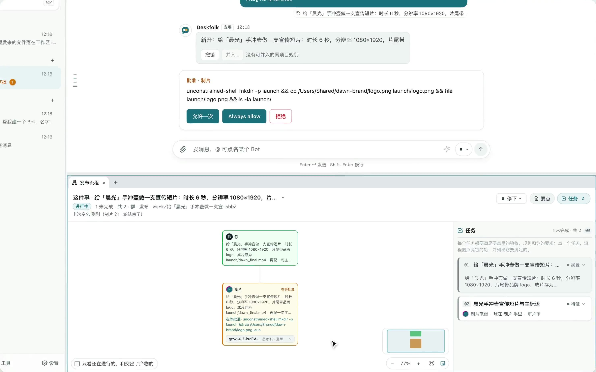
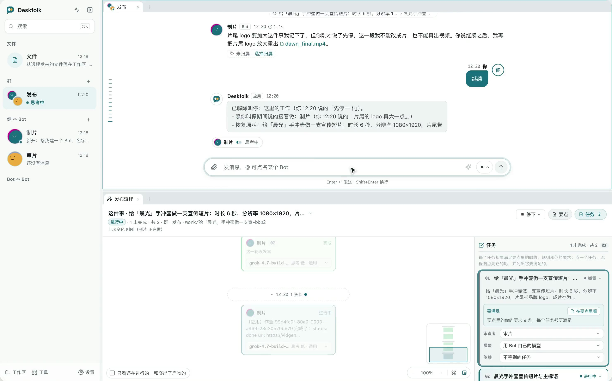
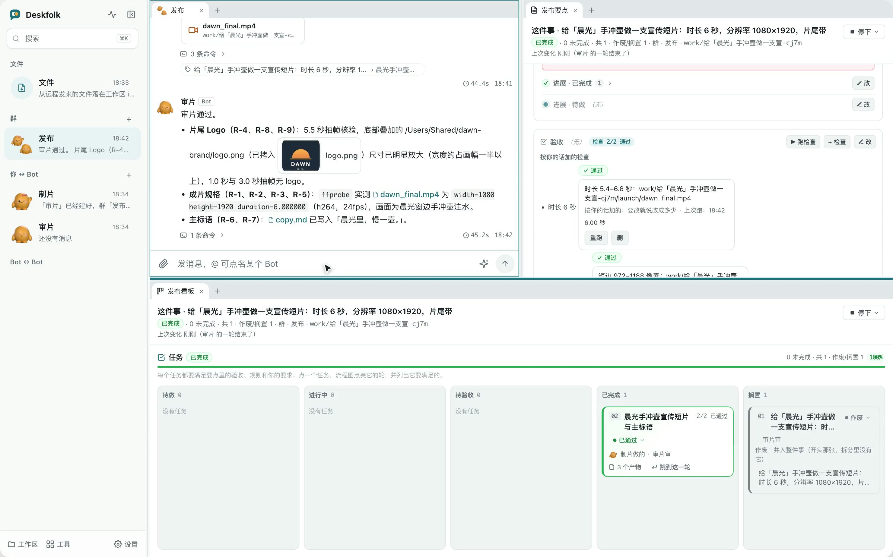
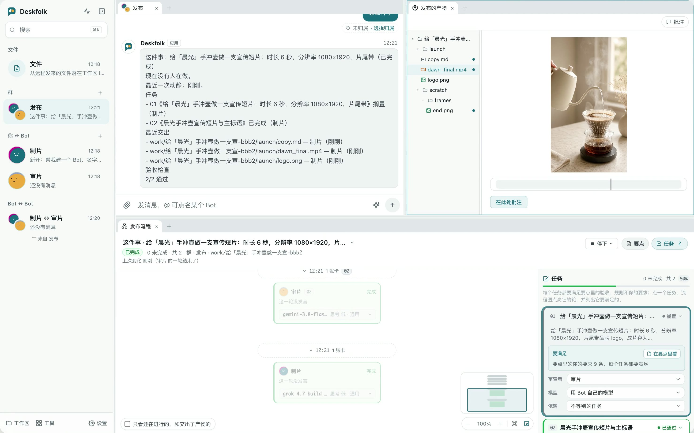

  
   
  另有 <a href="https://blackman99.github.io/deskfolk/media/deskfolk-mascots-en.mp4">English</a> 版

<h1 align="center">Deskfolk</h1>

交出去，离开，回来看结果。

多天、多步、要返工的活交给 Bot；Bot 说做完的，应用先核过。

  <a href="https://blackman99.github.io/deskfolk/zh"><b>官网</b></a> ·
  <a href="https://github.com/Blackman99/deskfolk/releases/latest"><b>下载 Alpha</b></a> ·
  <a href="docs/overview.zh.md"><b>介绍与安装</b></a> ·
  <a href="README.md">English</a>

  
  
  
  

<table>
  <tr>
    <td width="50%"> 工作区外的动作，先问你</td>
    <td width="50%"> 说停就停，只有你能解除</td>
  </tr>
  <tr>
    <td width="50%"> 做完有定义：检查、审查和你的放行</td>
    <td width="50%"> 回来看结果：会话、流程图、成品并排</td>
  </tr>
</table>

<a href="docs/overview.zh.md">介绍与安装</a> · <a href="ROADMAP.md">路线图</a> · <a href="docs/development.md">开发说明</a> · <a href="CONTRIBUTING.md">参与贡献</a> · <a href="SECURITY.md">安全说明</a> · MIT

