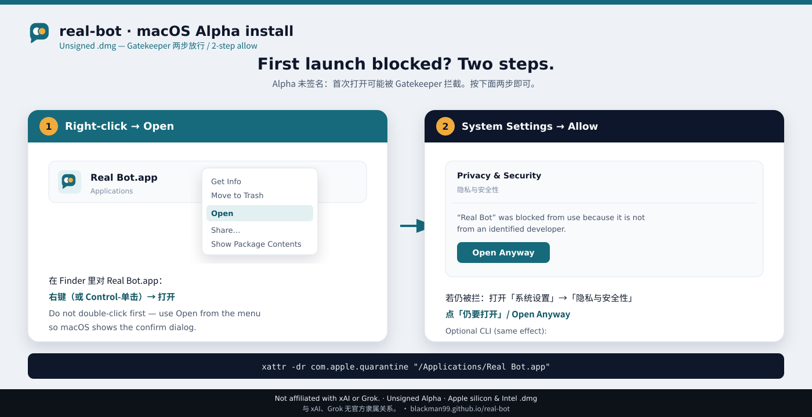

# Gatekeeper FAQ (unsigned alpha)

Real Bot’s alpha `.dmg` is **not notarized**. macOS Gatekeeper will warn on first open. That is expected until [Apple notarization](notarization.md) ships ([tracking issue #10](https://github.com/Blackman99/real-bot/issues/10)).

## Why the warning appears

Apple treats downloads without Developer ID + notarization as untrusted. The alpha build is unsigned on purpose while we finish the signing path — not because the app phones home or installs a hidden helper.

## First launch (2 steps)

1. In Finder, **right-click** (or Control-click) `Real Bot.app` → **Open**.
2. In the dialog, confirm **Open**.



If you already tried double-click and got blocked, the right-click path still works.

## Quarantine attribute (optional)

If Gatekeeper still refuses after right-click → Open, clear the quarantine flag once:

```bash
xattr -dr com.apple.quarantine "/Applications/Real Bot.app"
```

Then open the app again. This only removes the download quarantine attribute; it does **not** disable Gatekeeper system-wide.

## In-app updates are not stopped again

After the first open, "Download and install" in the About card has the app download and replace itself: the bytes never go through a browser, so they are never marked with the download quarantine attribute and there is no second right-click → Open. That also means this path's trust rests entirely on where it downloads from — it is limited to `.dmg` assets of this repository's releases, and the app inside the image is checked for this app's identifier and the exact version offered before anything is replaced. When the app cannot replace itself (a copy someone else installed, one running from source), it offers the browser download instead, and that download opens the usual two-step way above.

## After first open: expensive actions still ask

Opening the app past Gatekeeper is not a blank check. Inside Real Bot:

- New model endpoints and MCP servers, workspace-outside I/O, and outbound network stop on an **approval card**.
- High-cost or irreversible tool use waits for you — bots do not “send later” or burn quota without a clear go-ahead when the action needs approval.
- API keys stay in Keychain, never in chat.

Gatekeeper is about **macOS trusting the binary**. Approval cards are about **you trusting each expensive or dangerous action**.

## Not notarized yet

We will not claim the app is signed or notarized until Developer ID builds ship. Progress and checklist: [notarization plan](notarization.md) · [issue #10](https://github.com/Blackman99/real-bot/issues/10).

## Related

- [README — Get it](../README.md#get-it)
- [Development guide](development.md)
