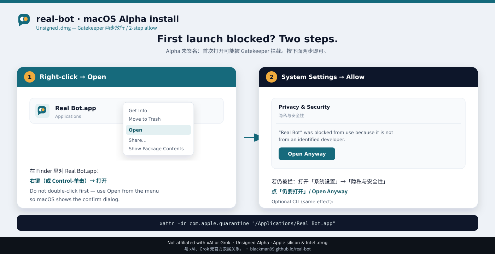

# Gatekeeper FAQ

From **0.1.0-rc.16**, Deskfolk’s `.dmg` is signed with Developer ID and **notarized by Apple**: double-click opens it, with no warning to get past. `spctl -a -vv /Applications/Deskfolk.app` says `source=Notarized Developer ID`. How the builds are signed: [notarization](notarization.md).

The rest of this page is for **0.1.0-rc.15 and earlier**, which were ad-hoc signed and not notarized, and for builds you make yourself without a Developer ID certificate.

## Why an older build is blocked

Apple treats downloads without Developer ID + notarization as untrusted. Those builds were unsigned while the signing path was being finished — not because the app phones home or installs a hidden helper. Updating to 0.1.0-rc.16 or later from the About card ends it.

## First launch of an older build (2 steps)

1. In Finder, **right-click** (or Control-click) `Deskfolk.app` → **Open**.
2. In the dialog, confirm **Open**.



If you already tried double-click and got blocked, the right-click path still works.

## Quarantine attribute (optional)

If Gatekeeper still refuses after right-click → Open, clear the quarantine flag once:

```bash
xattr -dr com.apple.quarantine "/Applications/Deskfolk.app"
```

Then open the app again. This only removes the download quarantine attribute; it does **not** disable Gatekeeper system-wide.

## In-app updates are not stopped again

After the first open, "Download and install" in the About card has the app download and replace itself: the bytes never go through a browser, so they are never marked with the download quarantine attribute and there is no second right-click → Open. That also means this path's trust rests entirely on where it downloads from — it is limited to `.dmg` assets of this repository's releases, and the app inside the image is checked for this app's identifier and the exact version offered before anything is replaced. When the app cannot replace itself (a copy someone else installed, one running from source), it offers the browser download instead, and that download opens the usual two-step way above.

## After first open: expensive actions still ask

Opening the app past Gatekeeper is not a blank check. Inside Deskfolk:

- New model endpoints and MCP servers, workspace-outside I/O, and outbound network stop on an **approval card**.
- High-cost or irreversible tool use waits for you — bots do not “send later” or burn quota without a clear go-ahead when the action needs approval.
- API keys stay in Keychain, never in chat.

Gatekeeper is about **macOS trusting the binary**. Approval cards are about **you trusting each expensive or dangerous action**.

## Keychain asks once more after the first notarized update

The Keychain knew an older build only by a hash that changed with every release, so each update asked for the login password again. A notarized build is recorded by its Team ID instead: the first update to one asks once more, and later updates do not.

## Related

- [README — Get it](../README.md#get-it)
- [Development guide](development.md)
