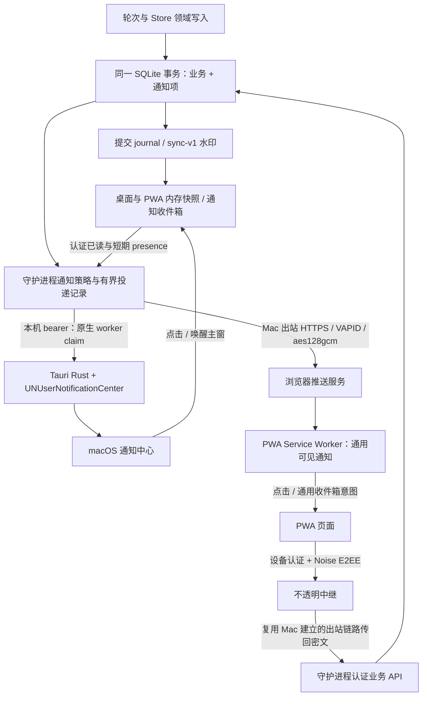
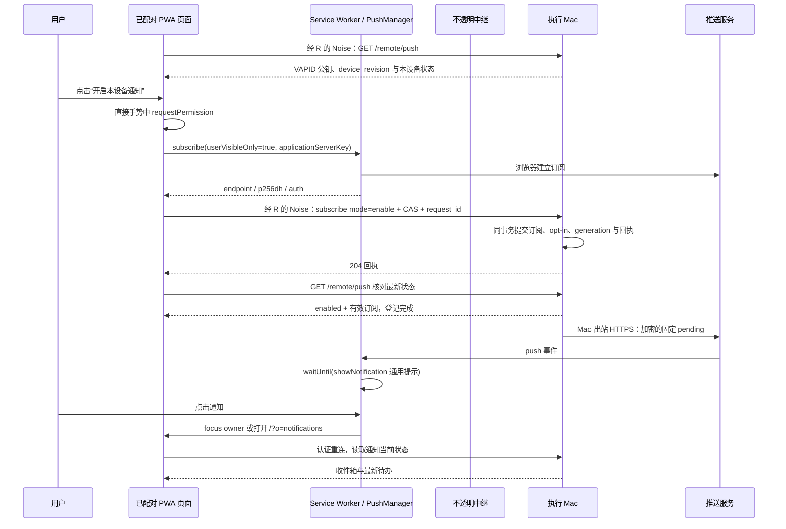

# 通知设计：桌面端与远程 PWA

- 日期：2026-09-21
- 状态：系统通知与远程推送已接入；应用内不再有通知铃铛或通知页，待处理状态标在会话列表上。生产 `push_transport` 为 `policy_v2`，出站发送、订阅与测试仍受远控激活门约束，解绑可用于清理。macOS 系统横幅物理门仍关闭（`NATIVE_DELIVERY_QUALIFIED` 为 false）；桌面与本机浏览器测试通知仅在 `native_delivery_v1` 成立时可用，入队为 queued，不是系统已展示。托管远程测试走远控门、联系人与订阅。下文 §5.1 / §5.2 描述的铃铛与收件箱页面已被这次产品决定取代。
- 范围：单人、本机优先的 Real Bot；macOS 桌面与已配对远程浏览器 / PWA。
- 交付性质：产品与技术设计。本文中的新增接口、表、组件和默认值均为提案；“现状”仅表示已核对源码，不表示本轮运行或真机验收通过。

## 1. 概览

通知帮助你及时发现需要批准、需要回答、未完成的工作与新回复，并从桌面或手机回到正确上下文。守护进程保存统一的通知收件箱；信使负责阅读与操作；Tauri 原生进程负责 macOS 系统通知；现有 Web Push 负责唤起远程 PWA。

系统通知是尽力送达的提醒，收件箱是可查询、可恢复的应用状态。已读、待处理与投递结果分别记录。打开通知始终先读取最新状态，批准、回答、继续和维护操作仍由用户在应用内显式执行。

远程路径继续遵守既有边界：执行 Mac 主动出站；中继只转发密文；最多 16 个已登记访问设备；访问端不保存离线业务历史、命令或批准队列。Web Push 明文固定为 `{"t":"pending"}`，连会话 ID、数量和事件类别都不加入。生产远控激活、原生凭据与真机门保持原样。

## 2. 背景与当前实现

### 2.1 已核对的实现与缺口

| 领域 | 当前源码行为 | 本设计的增量 |
|---|---|---|
| 提交与同步 | `apps/daemon/src/store/transactions.ts::Transactions.run` 在最外层 SQLite 提交后发布；`store/events.ts::committedEvents` 区分首次 `message.created` 与后续 `message.upsert`。`sync-v1` 有实例、水印、缺口重取快照。 | 在业务事务内持久化通知，复用提交事件与水印；不从流式输出或客户端猜测通知。 |
| 已读 | `store/sessions.ts::markSessionRead` 写服务端当前时间；`unreadCount` 按 `created_at > last_read_at` 统计，排除用户和 `profile_change`。 | 加入有界已读游标，避免未展示的新消息被一次“读到现在”吞掉。 |
| 客户端已读 | `runtime.svelte.ts::selectSession` 直接清未读并调用已读接口；`ingest` 对当前会话的主消息 created/upsert 标读；`sidebar/unread.ts` 对 selected 会话返回零。均未依据焦点或实际阅读位置。 | 当前会话与已读脱钩，由可见性、焦点、遮挡和滚动位置决定何时提交已读。引用回复也参与阅读。 |
| 阅读位置 | `chat/ChatStage.svelte` 持有 `stickToBottom`、滚动容器和跳转；`chat/stream-scroll.ts::STREAM_NEAR_BOTTOM_PX = 120`。 | 复用这套滚动事实，增加阅读可见性回调；不另起一套滚动判断。 |
| 批准 / 提问 | `turn-engine.ts::executeTools` 创建批准卡 / `ask` 消息，分别进入 `waiting_approval` / `waiting_ask`；`replyAsk` 校验 `live.ask.id`。转录 `isPendingAsk` 目前只看轮次状态，旧问题会被误画成可回答，客户端还会吞掉 422 后清草稿。 | 一张批准或一个提问只产生一项提醒；增加权威 `pending_ask_id` 与明确提交结果，修复旧卡及跨端回答竞态。 |
| 失败 / 中断 | `failTurn` 插系统消息并把轮次设为 `completed`，路由记录为 `outcome=failed`、`fail_kind`；中断由引擎 `interruptTurn` 和 Store 恢复两条路径落盘。`runtime.ts::stop` 先等 `engine.close()`，再扫剩余 live 轮。`TurnStatus` 没有 `failed` 或 `need_human`。 | 两条中断路径同事务建项，复用幂等键；失败使用结构化原因；“需要你”不新增轮次终态。 |
| 日程 | `fireRoutine` 经 `claimRoutineDue` 领取最近到期时间，在你↔Bot 私聊插一条用户形式的 instruction，fork 一轮并新建工作目录；当前轮次没有持久的 routine 来源字段。 | 保存本次日程来源，正确区分日程结果、普通回复与启动记录；保留只补最近一次的规则。 |
| Web Push 服务端 | `remote/push.ts::PushService` 已有订阅、原生 VAPID 读取、P-256/HKDF/AES128GCM 加密、HTTPS 主机允许名单、禁止重定向、TTL 60 秒、250ms 合并、404/410 删除订阅。 | 保留可复用密码与订阅路径，补策略、有限重试、订阅版本、吊销竞态防护与脱敏诊断。 |
| Push 分类 | `shouldNotify` 对批准、ask、bot、部分失败文案及 interrupted 通知；直接排除 Bot↔Bot 私聊，也排除了其中真实待批准。群里的 Bot 消息尚无精细分类；失败依赖中英文前缀。 | 统一分类，明确人类批准例外、群内协作过滤、语义唯一键；去掉按失败文案识别的依赖。 |
| Push 客户端 | `remote/push.ts::enablePush` 从用户操作申请许可、注册订阅，经 E2EE 上传。`SettingsModal.svelte` 已有远程待办推送开关。 | 收敛至“通知”设置，展示浏览器许可与主机订阅两层状态，补订阅漂移和失效恢复。 |
| Service Worker | `static/sw.js` 只缓存 `/_app/immutable/`；收到固定 pending 就显示通用通知；点击 focus 第一个窗口并发送 `{type:'inbox'}`，无窗口则打开 `/`。`+layout.svelte` 只在 hosted 构建注册 SW。 | 点开真正的通知收件箱、严格筛选窗口、保持业务零缓存；固定通知不承担后台业务同步。 |
| 当前“收件箱”行为 | `runtime.svelte.ts::onPushMessage` 只断开重连；没有专用通知列表与待处理总览。冷启动 `/` 也没有收件箱导航意图。 | 已连接时刷新收件箱，断线时重连后再打开；冷启动使用通用入口。 |
| 桌面 | `Cargo.lock` 锁定 Tauri 2.11.5；`Cargo.toml` 只有 autostart / single-instance 等依赖，没有 notification 插件。`lib.rs` 的 `show_main`、`RunEvent::Reopen`、关窗隐藏和退出监督已存在。 | 添加独立于 WebView 的原生通知适配器及点击桥；复用现有窗口与监督行为。 |
| 远程多标签页 | `apps/relay/src/server.ts` 同一 device 已有 route 时拒绝第二条 route；身份按浏览器存储分区保存在 IndexedDB。 | 同源标签页协调连接所有者，避免开第二页就争抢设备通道。 |

本机没有可直接复用的通知中心。现有原型 Web Push 已在当前工作树中，不能按历史记忆视为尚未合并。`.scratch/v1/map.md` 的通知分类空缺及早期移动端范围仅作历史参考，当前约束以 `CONTEXT.md`、远控协议和实际代码为准。

### 2.2 平台事实与验证边界

- 本应用发布目标最低 **macOS 13.0**，当前包使用 ad-hoc 签名；签名、公证、真实安装包通知权限与重新启动行为须单独验证。
- Tauri 官方通知文档将 Actions API 标为 **Mobile Only**。本轮查看的上游 v2 分支 `notification/Cargo.toml` 标为 2.4.0；其 `src/desktop.rs` 仅把 title/body/icon/sound 交给 notify-rust，权限查询 / 请求直接返回 Granted，开发态 macOS 使用 Terminal 身份。不能据此承诺准确的系统权限、macOS 点击回调或冷启动恢复。此为所查源码事实，实施时须重新核对并锁定依赖版本。
- WebKit 文档确认 iOS / iPadOS **16.4+ 的主屏幕 Web App** 可通过直接用户手势申请 Web Push；普通浏览器标签页不因此获得该安装应用的后台通知能力。macOS Safari 的标准 Web Push 基线为 Safari 16.1 / macOS Ventura。
- Chrome / Chromium、Firefox、Safari 的实际支持按 `Notification`、`serviceWorker`、`PushManager` 和安全上下文检测；可安装性、推送服务域名及后台策略分别验证。当前主机允许名单未覆盖的推送服务应显示“不支持此推送服务”，不能任意扩域。
- **G-push、物理 iOS L1、G-uv、S-rev、G-pack / G-launchd 均不因本设计或浏览器模拟通过。**

## 3. 目标与范围

### 3.1 目标与可量化预算

1. 任何真实待批准、有效提问都能从统一入口找到；读取与关闭通知不影响它们的业务状态。
2. 用户前台阅读时保持安静；后台长任务结束、需要人处理或真正失败时及时提醒。
3. 同一业务事实只有一个收件箱项；重复事件、重连、回应表情、附加附件都不再次生成提醒。
4. 在隔离的 10,000 项通知 fixture 中，收件箱第一页 50 项本机查询 p95 ≤100ms；已连接 UI 提交后更新 p95 ≤500ms。桌面轮询与 2 秒合并策略下，在本设备限流槽可用时，首次本机系统投递尝试 p95 ≤5 秒。远程网络和 OS 展示延迟单独测量，不作为保证。
5. 每设备所有实际发送尝试（新业务、重试、测试）共享至少 30 秒间隔；收件箱逐项保留。OS 展示时刻和供应商重复不受此间隔保证，应用不承诺“每 30 秒最多看到一次”。不存在周期性“催批准”。

### 3.2 首版范围

- 应用内通知收件箱、总角标、会话已读修正、桌面原生提醒、现有 Web Push 完整化。
- 分类开关、会话级普通回复静音、全局免打扰、本设备开关、原生声音与预览偏好。
- 可靠导航、主机不可达 / 权限拒绝 / 订阅失效 / 目标删除等状态。
- 延续既有单人身份、审批、回执和远程维护验证。

不增加邮件、短信、官方推送后台、任意 webhook、多租户通知平台或移动原生 App。首版采用单个守护进程内的领域模块与 SQLite，没有外部消息队列。系统通知不提供允许、拒绝、输入答案、Stop、继续等快捷动作。

## Key Decisions

| 编号 | 决策 | 依据与代价 |
|---|---|---|
| D1 | 守护进程保存共享通知收件箱，业务事务内写入。 | UI / SW 生命周期不可靠；Mac 已是唯一业务事实来源。增加少量 SQLite 状态。 |
| D2 | 共享已读、独立待处理、按设备投递。 | 一个人跨端阅读应同步；已读不能批准或解决失败；系统接受请求不代表人看到。 |
| D3 | 批准在所有会话中都属于人类待办，包括 Bot↔Bot 私聊。 | 这类会话可由用户批准，现有过滤会遗漏真实阻塞。Bot↔Bot 普通对话仍保持安静。 |
| D4 | macOS 由 Tauri 原生进程唯一投递，采用小型 `UNUserNotificationCenter` 适配器。 | 当前插件不足以兑现权限、点击与冷启动契约；不依赖隐藏 WebView 活性，也不新增第三个常驻通知进程。 |
| D5 | PWA 推送始终只有 `{t:'pending'}`，点击进入收件箱。 | 保持协议隐私边界；接受系统提示无法精确指向某一条业务消息、无法离线给出准确数量。 |
| D6 | 先在 Mac 端抑制不必要投递；每个已接收的有效 Web Push 都产生可见通知。 | WebKit 要求 userVisibleOnly，SW 不能以“前台已有页面”为由吞掉合法 Push。允许竞争窗口中的重复提醒。 |
| D7 | 默认每个已启用设备独立提醒；跨设备共享已读可撤销尚未发送的普通回复。 | 前台 presence 不是用户已看到的证据。首版不承诺跨设备 exactly-once。 |
| D8 | 已读使用服务端验证的消息上界；访问端只在内存发起写入。 | 防止后台页吞未读和迟到请求覆盖新状态；无离线已读 / 批准队列。 |
| D9 | 日程结果基于持久的本次运行来源，失败基于结构化结果。 | 不从重复 instruction、`completed` 或本地化正文推测成功。 |
| D10 | 桌面通知可独立上线；远程推送沿用所有激活门。 | 本机功能不因远控封闭门阻塞，远控也不借通知绕过封闭门。 |

## 4. 哪些事情值得提醒

### 4.1 分类与默认策略

以下“系统提醒”均受本设备许可、类型开关、免打扰和合并策略约束；不影响应用内收件箱及原业务状态。

| 类别 / 语义键 | 产生条件与来源 | 默认系统提醒 | 结束 / 处理方式 |
|---|---|---|---|
| `approval` / `approval:<id>` | 新增 `Approval.status=pending`；以 approval 实体为唯一来源，卡片消息不再生成第二项。 | 开 | resolve 后已处理；Stop / 改道 / 中断 / 删除后已失效。 |
| `ask` / `ask:<message_id>` | `kind=ask` 已插入且所属轮进入 `waiting_ask`；支持同一轮多次提问，按 ask ID 分开。 | 开 | 仅成功接受匹配 `ask_id` 的回答才完成；轮次终止后失效。 |
| `failure` / `failure:<turn_id>` | `failTurn` 的最终失败，包括无模型、真实补全失败、运行时异常和 stuck。工具一次失败后自行恢复不触发。 | 开 | “我知道了”关闭待查看；原失败记录保留，文案不宣称工作已修复。 |
| `interrupted` / `interrupted:<turn_id>` | 引擎 runner 退出的 `interruptTurn`、Store 扫描与启动恢复产生真实中断。用户主动 Stop、正常改道、睡眠均排除。 | 开；重启时合并一条摘要 | 点击 Continue 成功创建新轮后该项已接手，或用户“我知道了”；绝不重试旧工具。 |
| `reply` / `reply:<message_id>` | 新增有实际正文或产物的最终 Bot 消息，且符合下方“面向你的回复”规则。 | 开 | 已读后不再进入未读筛选；不要求处理。 |
| `routine_result` / `reply:<message_id>` | 日程根轮实际产生的最终回复；同一消息只归此类，不同时算普通回复。 | 开 | 已读；无实际产出的静默完成不生成“成功”提示。 |
| 日程的批准 / 提问 / 失败 / 中断 | 沿用上述对应类型，加日程来源标识。 | 随对应类型 | 关闭“日程结果”不会关闭这些阻塞 / 失败提醒。 |

“面向你的回复”采用可解释规则，不引入模型分类器：

- 你↔Bot 私聊中的最终回复属于你，包括 Bot 通过 `send_message` 发到该私聊的消息。
- 群中直接由用户消息触发的轮次，或明确引用用户消息的最终回复属于你；带有实际 Bot 点名、用于把活交给别人的消息按协作消息排除。点名解析复用协议包，不用字符串 `includes('@')`。
- 由 Bot 消息触发、继续在群里交接且没有引用用户的消息保持转录可见，不进入普通回复通知。首版接受这会漏掉一部分没有显式引用的间接汇报；Bot 可以向你私聊或引用原用户消息表达交付，不通过正文“看起来完成了”猜测。
- 源轮次跨会话发送时用 `messages.source_turn_id` 查实际来源；本会话产物回复用 `turn_id`。这两个字段的现有含义保持不变，中断 Continue 对 `source_turn_id` 的更新也不能误判为新回复。
- 群通知按会话合并，不要求每位 Bot 发一条系统横幅。归档会话继续记录待批准 / 提问，普通回复默认静音；删除会话清除对应通知。

失败 / 中断默认也限定为你在场的私聊或群；Bot↔Bot 内部失败由上游 Bot 汇报到用户会话后再通知，避免一件事跨多个内部轮次报警。**待批准是明确例外**，因为只有你能解除这个阻塞。日程来源先覆盖根轮自身的结果和等待，不把同一工作目录里的每条交接都当作独立日程结果。

**明确排除：** token / partial text、思考与工具调用进度、重试日志、工具普通输出、成功探测 / 设置保存、参与判断与旁观、用户自己的消息、日程启动 instruction、空收尾、Bot↔Bot 普通消息、群内 Bot 交接 chatter、reaction、`profile_change`、单纯附件补写、常规连接抖动、Spend 更新。连接状态留在界面横幅。Bot↔Bot 中 `ask_user` 当前被拒绝，不为不存在的可回答提问创造通知。

### 4.2 已读、待处理、投递三个维度

| 维度 | 数据 / UI | 谁能改变 |
|---|---|---|
| 阅读 | `read_at=null / 时间`；“未读 / 已读”。 | 可见阅读或显式标读，经服务端提交，多设备共享。 |
| 业务处理 | `action_state=none / open / resolved / voided`，加 `resolution_reason`。 | 批准 / 提问由业务实体决定；失败 / 中断可由“我知道了”确认已查看；Continue 仍走原接口。 |
| 投递 | 每设备、每批次的 `pending / claimed / accepted / retry_wait / suppressed / expired / failed / unknown`，带固定原因码。 | 通知投递器；accepted 仅指系统 API 或推送服务接受。 |

- 打开收件箱不把全部项目标读。某行在可见区持续 1 秒且页面有效前台时才标该行已读；快捷“全部标为已读”只覆盖点击时列表的服务端上界。
- 看过批准卡后仍显示“已读 · 等你批准”；系统通知被滑掉只关闭 OS 展示，不改变业务和已读。
- 通知行不内嵌危险动作按钮。进入原转录后使用当前批准卡和当前权限；已过期卡显示失效说明。
- 共享角标定义为 **未读项与 open 项的去重并集**。一项“未读且待批准”只算一次；铃铛同时给出“待处理 2”辅助文字，避免全部标读后仍有数字却无法解释。
- 会话角标继续表示消息未读数，待批准 / 待回复继续使用现有工作状态标记。两种数字允许不同，界面明确命名。

## 5. 用户体验

### 5.1 桌面入口与收件箱

在 `sidebar/Sidebar.svelte` 工具区增加带标签 / tooltip 的铃铛；右侧打开宽约 400px 的 `NotificationInbox.svelte`，保留原聊天上下文。已存在危险确认和编辑草稿优先处理，遵循 `Shell.svelte` Escape 顺序与 `requestCloseFromParent` 未保存确认。

文字线框：

> 侧栏底部：工作区　**通知 5**　设置 
> ┌ 通知　　　　　　　　　全部标为已读　× ┐ 
> │ **待处理 2**　未读 3　全部　　　　　　 │ 
> │ ● Writer · 等你批准　　　　　　　　　 │ 
> │   Brief　2 分钟前　[查看批准]　　　　　│ 
> │   已读 · Researcher · 等你回答　　　　 │ 
> │   调研　8 分钟前　[查看问题]　　　　　│ 
> │ ── 工作结果 ────────────────── │ 
> │ ● 每日简报 · 本轮未完成　　　　　　　 │ 
> │   [查看原因]　[我知道了]　　　　　　　│ 
> │ ● Writer · 有新回复　[查看回复]　　　 │ 
> └──────────────────────────┘

默认打开“待处理”（存在 open 时），否则打开“未读”。已处理项在“全部”中保留最近历史。行内最多两行摘要，正文经纯文本清理；批准的命令、区外路径、密钥输入只在原卡片展开，通知摘要不复制它们。

macOS 通用预览示例为“Real Bot 有待处理事项 / 打开查看”。用户显式开启本机详细预览后，可显示 Bot / 会话名与普通回复前 80 个码点；提问、批准和失败仍用分类通用文案，防止问题或异常带出凭据。详细预览会写入 macOS 通知中心，此后不能承诺应用删除能清除所有系统副本。

### 5.2 手机 / PWA 入口

保留 `MobileNavigation.svelte` 的 **会话 / 工作区 / 设置** 三入口，在会话列表顶部增加铃铛与角标。打开通知为全屏列表，顶部返回、筛选固定，点击进入会话；会话详情继续隐藏底栏。首版不增加第四个常驻底栏入口。

> 会话　　　　　　　　　[通知 3] 
> …现有会话列表… 
> 会话　　　　工作区　　　　设置
>
> ‹ 会话　　　　通知　　　　⋯ 
> [待处理 1]　[未读 2]　[全部] 
> Writer　　　　　　　　刚刚 
> 等你批准　　　　　　　　› 
> 已读 · 请求仍待处理 
> ────────────────── 
> 每日简报　　　　　　　08:30 
> 有新结果　　　　　　　　›

设置根新增“通知”类别，进入独立详情页；沿用移动设置内层返回 / 浏览器 Back 规则。交互目标最小 44×44px，状态不只靠颜色；列表使用原生按钮、键盘可达，角标有完整读屏说明，状态变更用 polite live region，不逐条朗读流式输出。

### 5.3 前台、当前会话与滚动位置

有效阅读要求：已连接且详情水印就绪、页面 `visibilityState=visible`、`document.hasFocus()`、转录没有被全屏设置 / 工作区 / 收件箱遮住。桌面额外要求 Rust 报告主窗可见、获得焦点且未最小化；WebView 自报焦点不足以代表桌面前台。PR 3 连接尚无 `native_reading_v1` 的桌面壳时，保守关闭转录与收件箱行的自动标读，保留显式标读；PR 5 提供桥后才开启自动模式。普通浏览器 / PWA 可按浏览器阅读事实工作；两种降级分别显示能力说明。

| 状态 | 未读更新 | 本设备系统提醒 / 应用内提示 |
|---|---|---|
| 正看当前会话最新内容，距底部 ≤120px，目标已渲染 1 秒 | 上报确实展示过的最大消息序号，服务端推进 | 系统提醒暂缓 2 秒，若完成阅读即取消；批准 / 提问仍保留待处理状态。 |
| 当前会话向上翻历史 | 保持新消息未读，不抢滚动位置 | 普通回复仅显示“有新消息，回到底部”；需要你 / 失败给固定应用内提示。 |
| 前台正看另一会话或设置 | 不自动标新消息已读 | 应用内轻提示 + 铃铛；该设备系统横幅抑制，离开后重新评估尚未见到的需要你事项。 |
| 窗隐藏 / 最小化、标签页后台、设备锁屏 | 不标读 | 按设备策略发送系统提醒。 |
| 搜索 / 通知跳到旧消息 | 仅把可见通知项标读 | 不顺带把该会话更新的消息清零。 |
| 断线 / 尚未获取最新快照 | 保留只读状态说明，禁止标读写入 | “执行主机不可达”；无业务缓存回放。 |

离开前台后，尚未读的 needs-human 项在合并窗口重新获得投递资格；在前台已看过的同一批准不因切窗口再次鸣响。普通回复被前台策略抑制后只留未读角标，避免用户刚离开就收到陈旧消息。

### 5.4 具体状态与文案

- 空态：“暂时没有需要你处理的事项”；未读空态：“都看过了”。
- 正在连接：“连接执行 Mac 后读取通知”；已载入列表在断线时撤下业务内容，显示主机不可达及重试，未发送草稿仍只在当前页面内存按既有确认流程处理。
- 权限未询问：“开启这台设备的系统通知”，按钮才触发系统对话框；关闭按钮不会反复请求。
- 权限拒绝：“系统通知已被阻止。通知仍会出现在应用内。”提供系统 / 浏览器设置说明。
- iOS 未安装：“添加到主屏幕后，从该图标打开并开启通知”；不可把这个状态一概显示成永久不支持。
- 订阅失效 / 密钥变化：“需要重新开启此设备通知”；许可已给但主机未登记：“浏览器已允许，尚未连接执行 Mac 完成登记”。关闭分别展示本地清理和主机停用的确认；两边未确认时显示“关闭尚未确认，仍可能收到通知”，不显示关闭成功。
- 目标已处理：“这项请求已处理”，显示当前状态，可查看原消息；已删除 / 历史清空：“原内容已不存在”，移除失效导航参数并回收件箱。
- 点击旧 Push 后待办已空：“当前没有待处理事项”，解释它是一条较早的提醒。
- 测试通知：“测试通知已提交给系统 / 推送服务；实际展示由设备决定”，避免“送达成功”。

### 5.5 设置与作用域

| 设置 | 作用域 / 保存位置 | 提议默认 |
|---|---|---|
| 批准、提问、失败 / 中断、普通回复、日程结果 | 全局策略，Mac SQLite；所有访问端可在 E2EE 内修改 | 全开，控制系统提醒；收件箱照常记录。 |
| 会话普通回复静音 | 全局会话偏好，Mac SQLite | 关闭；归档会话普通回复静音。批准 / 提问不受此开关影响。 |
| 免打扰 | 全局策略；IANA 时区与时间区间持久保存 | 默认关闭；启用初值 22:00–08:00，时区取设置时执行 Mac 时区，明确标注。 |
| 本设备系统通知 | 本机 `desktop`，或认证的远程 `device_id` | 首次关闭；用户手势授权并登记成功后开启。 |
| 声音 | macOS 原生设备偏好 | 默认关；开时请求系统默认声音，系统专注模式仍可抑制。PWA 显示“由系统管理”，不承诺跨浏览器静音 / 自定义声音。 |
| 预览内容 | macOS 本设备偏好 | 默认“仅通用提示”；可选“普通回复摘要”。PWA 固定通用提示，禁用详细预览并说明隐私原因。 |
| 应用图标角标 | 本设备偏好 | 默认开；只支持的平台显示。 |

免打扰在 Mac 端阻止投递，不在 SW 接收后吞通知；不设“批准绕过免打扰”。跨午夜与夏令时按 IANA 时区本地时刻判断，下一边界重新计算；恢复提醒时只发一次仍有未读 / 未处理的摘要，不逐项补响。用户改变 OS 权限立即影响该设备，不能由另一设备授权。访问设备数保持 ≤16；桌面自身是本机接收端，不占远程设备名额。

## 6. 技术架构

### 6.1 领域写入与幂等

新增 `apps/daemon/src/store/notifications.ts`，按现有 `fn(ctx, ...)` 领域模块模式暴露 Store 方法；纯分类规则放 `apps/daemon/src/notification-policy.ts`。不要在 `PushService.notify(ClientEvent)` 内继续独立维护一份业务分类。

关键写入点：

1. `store/approvals.ts::insertApproval` 与通知插入同事务；`resolveApproval` 以及 `store/turns.ts` 的停止 / 改道 / 中断 / 恢复路径同步使对应通知完成或失效。
2. `turn-engine.ts::executeTools` 把创建 ask、写 `waiting_ask`、创建通知包在同一同步 `Store.transaction` 中。批准卡、approval、waiting 状态同样收拢到一个同步事务；实际工具、waiter、网络调用仍在提交后。
3. `replyAsk` 同时校验持久 `pending_ask_id` 与当前 `live.ask.id`，在接收答案的同一业务事务中清空该指针、转 running、关闭该 ask 通知。创建下一次 ask 时原子替换为新的 ID；Stop / 改道 / 失败 / 中断一并清指针并作废旧 open ask。不得按一次 running 事件关闭另一条新问题。完整 UI 与错误合同见 §8.1。
4. 最终 Bot 消息在 `store/messages.ts::insertMessage` 的领域入口分类并建项；跨会话 `collab-tools.ts` 路径同样覆盖。卡片消息、reaction 与 `message.upsert` 不建项。
5. `failTurn` 在已有事务中写 `failure` 通知和 `fail_kind`，不增加 `TurnStatus`。`finishTurnRoute` 缺少路由行时可能无结果，故通知不能只依赖路由表反查；由失败调用点直接传结构化原因。
6. **同时覆盖 `turn-engine.ts::interruptTurn` 与 `store/turns.ts::interruptRunningTurns` / `recoverInterruptedTurns`。** 提取同步中断领域函数，由引擎 runner 的 abort-finally、退出扫描、崩溃恢复及强制 drain 路径共同调用。在同一事务内重新确认轮次仍 live、作废批准 / ask、清 pending_ask_id、设置 interrupted、插中断消息并创建 `interrupted:<turn_id>` 通知。已经终态则不重复写；显式原因来自调用入口，不能匹配正文或挂在任意 `setTurnStatus` 上猜。`runtime.ts::stop` 先等 `engine.close()`、再扫描时，已经被 runner 中断的轮次已有通知，不依赖后一扫描补建。Stop / redirect 的终态在 abort-finally 前已提交，不创建中断 / failure 通知。
7. `fireRoutine` 把 claim、触发消息、带来源的根轮创建放进同步外层事务；实际 runner 沿用 `attachLive` 的 `afterCommit`。这样领取成功但轮次未建立的崩溃不会悄悄漏一轮；通知不引入新的补跑任务队列。

向 `store/events.ts` 注册通知与读游标实体，提交后发 `notification.upsert` / `notification.removed` / `notification.summary`。不可在 `committedEvents()` 回调中再创建业务通知：那时业务事务已经提交，会产生崩溃缺口和发布递归。投递器只消费已提交项，在业务事务外等待系统、Keychain 或网络。

### 6.2 默认合并、限流与恢复

- 收件箱按语义键逐项保存；系统投递 2 秒收集窗，桌面按会话合并，远程每设备仅一个通用 pending 摘要。
- 每设备最多一个 in-flight 批次，全主机最多 4 个并发出站请求。**所有实际尝试共用 next_send_at，至少间隔 30 秒**，包括新业务、已失败 / unknown 的重试和用户测试；订阅更新、重启或测试请求不能重置这个时刻。实际发送时间为 `max(合并到期,退避或Retry-After,设备next_send_at)`，超过批次绝对截止则过期。主机发出前持久化占用发送槽；原生由 revalidate 授予一次立即使用的发送许可，许可不用也不提前退还槽，避免崩溃后短间隔重发。
- 同一窗多个会话合成单条摘要，点击进收件箱。调度先完成最早已形成的业务批次（含有限重试），再处理尚未成批的业务候选，测试最后；无业务可发送而旧批仍在退避时可用空闲槽发送测试，但它也会推迟后续最早发送时间。新候选按产生时间公平合并，已有批次不被无限延长；等待最多受 120 秒批次截止约束，待批准始终保留在收件箱。频繁更新只推进尚未 claim 批次的覆盖上界；已 claim 的集合 / 版本固定，新项进入下一批。
- 发送前重新检查当前 read / action 状态、静音、免打扰；远程通道额外检查远控激活和设备信任，本机原生通道不依赖远控开关。关闭设置或删除目标后取消尚未发送批次。
- 待处理项不因系统尝试失败而消失；已接受批次不进行周期性提醒。新项可创建下一批，旧 open 项可一并计入摘要，但不会单独触发再鸣响。
- 睡眠恢复 / 守护进程启动时重新检查未终结投递。过期的普通回复仅留收件箱；未读且 open 的批准 / 提问及中断摘要最多补发一个批次。已处理、已读等待项和已确认失败不再补响。
- 恢复逻辑使用耐久批次状态与覆盖序号，不能把整个历史快照当成“新事件”发一遍。投递记录被清理后由单设备高水位继续防止旧回复重放。

### 6.3 presence 与多端重复

presence 是认证连接上的短期界面事实：实例随机 ID、可见 / 焦点状态、当前会话、是否在最新位置及最后心跳时间。Mac 使用自己的接收时钟，10 秒租约、前台每 5 秒更新，隐藏立即失效；断开和睡眠超时即丢弃，重启不恢复。限每连接 1 次 / 秒、每设备最多 4 个记录。

- 本设备前台有可见 UI 时抑制本设备系统提醒；当前目标是否已读仍须独立阅读提交。
- 桌面 presence 的有效焦点由 Rust 与 WebView 一起确认。普通本机开发浏览器不作为桌面原生窗口，也不发送浏览器系统通知。
- 远程多个标签页共享同一存储设备身份，使用 Web Locks 选出唯一连接所有者，BroadcastChannel 仅传连接协调 / “打开收件箱”控制消息，不广播密钥、命令或业务快照。第二页显示“此设备已在另一标签页连接”，用户可显式接管；旧页关闭 Noise 并释放锁后新页才连接。
- 冻结标签页未释放锁时，接管超时 5 秒后提示关闭旧页，不强开第二连接。没有 Web Locks 时保留单标签页模式与 relay 的单路由拒绝，不宣称自动选主有效。SW 点击优先聚焦已报告的 owner，退而选择作用域内已有窗口，再新开。
- 桌面与另一浏览器 / PWA 安装没有可靠的跨容器“同一物理设备”身份；它们可能都提醒。允许用户关闭其中一个本设备开关，不采集指纹识别机器。
- 全局已读可取消其他端尚未发送的普通回复；presence 本身不全局压制手机提醒。已送至供应商、已被 SW 接收或已由 OS 展示的通知可能仍出现，不能提供跨设备无重复 / 撤回保证。

## 7. 数据模型与迁移

### 7.1 新增及扩展数据

以下表仅存执行 Mac；除现有身份与纯偏好外，不在 PWA IndexedDB / localStorage 镜像。

| 表 / 字段 | 核心字段与约束 |
|---|---|
| `notifications`（新增） | `id` ULID；`ordinal` 耐久递增整数；`semantic_key UNIQUE`；`kind`；`session_id`、`message_id`、`turn_id`、`approval_id` 可空引用；`routine_id`、`routine_due_at` 可空；`created_at`、`read_at`、`terminal_at`；`action_state`、`resolution_reason`；`fail_kind`；递增 `revision`。不存正文 / 命令 / 密钥副本，展示时从源实体取受限摘要。 |
| `notification_policy`（新增单行） | `revision`、分类布尔开关、免打扰 enabled / start / end / IANA timezone；会话回复静音放单独的稀疏 `(session_id, muted)` 表。 |
| `notification_devices`（新增） | `receiver_id` 为本机 `desktop` 或现有远程 device ID；`revision`、enabled、native sound / preview / badge；远程 `push_generation` 单调递增且删除订阅后仍保留、最近失效 endpoint hash / reason；耐久已计划 ordinal、last_attempt_at / next_send_at、投递诊断摘要。浏览器 permission 只作当前观测。 |
| `notification_deliveries`（新增） | 随机 `delivery_id`、receiver、channel、覆盖 ordinal 上界、随机 native click ref、state、attempt、next_attempt_at、absolute_expires_at、claim token / expiry、push_generation、trust generation、固定 error code。唯一约束 `(receiver, channel, batch_key)`。状态更新 CAS；每设备最多一个活批次，历史保留 7 天 / 全局最多 2,000 行。 |
| `remote_push_subs`（扩展） | 保留现有 device_id、完整 endpoint、endpoint_hash、p256dh、auth、expires_at；增加 generation（取 device 行的 push_generation）、VAPID 公钥指纹和当前诊断。完整 endpoint 是发送必需的能力 URL，不能仅存 hash；不加入业务快照。版本不在这张可删除行上重新从 1 计数。 |
| `messages` / `sessions`（扩展） | `messages.message_seq` 耐久单调整数；`sessions.read_through_seq` 默认 0。保留 `last_read_at` 兼容旧读模型，更新时用被确认消息时间，不把浏览器时钟写进去。 |
| `turns`（扩展） | 增加可空 `pending_ask_id`（引用本轮 ask 消息），与 waiting_ask 状态及通知同事务更新。根日程轮增加可空 `routine_id`、`routine_due_at`；删除日程后 ID 可置空，due_at 保留。下游交接不伪装为另一次日程成功。 |
| 计数器（新增单行） | 分别分配 notification ordinal 与 message_seq；只在同一 SQLite 同步事务内递增。序号与 `event_instance_id/seq` 无关，进程重启不重置。 |

订阅身份为 `(device_id, push_generation)`：生成 / 替换材料、明确关闭、到期 / gone 失效和 VAPID 轮换作废时，在同一事务提升保留的 device generation；订阅行删除也不删除这个计数器。重新开启分配更大值，禁止归零或复用。设备行只有在身份永久吊销、所有旧 principal 不能再认证之后才可退休；新配对使用新 device ID。发送任务和所有异步结果（包括成功诊断、404/410 删除、失败计数）均携带捕获的 generation 与 trust generation，在提交时同时匹配当前 device 及订阅行；旧代结果只终结旧 delivery，不更新新订阅 / 新设备诊断。这样即使 abort 与回调竞赛，unsubscribe→resubscribe 也没有 ABA 缺口。

`action_state`：普通回复 / 日程结果为 none；批准 / 提问为 open→resolved 或 voided；失败 / 中断为 open→resolved（原因 acknowledged / continued），仅表示已查看或已接手。普通标读不能改变 action_state。

保留策略覆盖 **所有 non-open 项：none、resolved、voided**，合计最多 10,000 项、最长 30 天。none 以 created_at 起算；resolved / voided 在首次进入该终态的同一事务写 terminal_at，并以此起算；重复状态事件不刷新年龄。按起算时间、ordinal 从旧到新淘汰，任一年龄 / 数量条件满足即清理。open 项不按这两个条件淘汰。淘汰任何未读 non-open 项（包括 voided）时，更新单行 `notification_retention_notice`（仅含发生时间和是否已读），显示“较早通知已整理，可到会话查看”；该提示不创建系统投递。原转录不删除，真实 open 批准 / 提问不被淘汰。大量 open 项分页显示，不为控制通知数量停止引擎。

投递批次需要明确覆盖集合：增加 `notification_delivery_items(delivery_id, notification_id)` 关联表，并在 delivery 记录上下 ordinal 边界；一个普通批次最多 100 项。积压过多时使用范围摘要批次，由边界内仍符合条件的当前项求 count，不复制正文或创建万行内存数组。高水位只推进已经形成批次、永久抑制或过期的候选；等待前台租约 / 免打扰结束的候选继续保留，不可先越过它再永久漏发。批次序号与业务条目序号分开，既避免历史重放，也不阻止仍未读的 open 项在恢复时形成一次摘要。

“我知道了”同时写 read_at 与 resolved；成功回答 / resolveApproval / Continue 也把相应项标读并写处理原因。自动失效保留原 read_at，使用户还能看到较早通知的变化。通知行单项标读不推进整段会话游标：它表示已经看过提醒，不代表读完转录，这个区别在批量标读入口保留。

### 7.2 消息已读上界

服务端为所有消息分配 `message_seq`，用于阅读顺序而不改变现有转录 `created_at,id` 排序。为覆盖 `store/turns.ts` 的原始 INSERT 等入口，由 SQLite INSERT 触发器分配序号并写回；同事务的 journal UPDATE 仍合并为首次 `message.created`，沿用现有 inserted 检测。索引和 backfill 完成后再安装该触发器。

新的 `POST /v1/sessions/:id/read` 请求传 `through_message_id`。服务端核实消息属于该会话，查其 seq，单调更新 `read_through_seq=max(old, bound)`，并标读该范围内对应通知。比上界更晚插入的消息不受影响。引用回复作为主转录的一部分正常计数。客户端只在最新页确已渲染并处于有效前台底部时提交已展示的最大 seq；搜索旧消息只标指定通知，避免批量越过未看的新消息。

旧客户端空请求在兼容窗口内保留服务端当前上界语义，升级后的客户端全部传界限；远程 routes 白名单明确允许新字段。新客户端连接旧服务端时关闭自动标读、提示客户端需更新，避免悄悄回退到旧行为。自动读写失败只显示状态未同步，断线丢掉待发阅读意图；重连后用户重新看到目标才产生新写入。

### 7.3 迁移与删除

1. 保存变更前 schema 到 `apps/daemon/src/store/fixtures/`；新列同时进建表定义和 `migrateSchema`。新增依赖列的索引 / trigger 只在迁移后创建，遵守 `docs/development.md` 的最老库兼容规则。
2. 老消息按 `created_at,id` 确定性 backfill 序号；`read_through_seq` 取旧 `last_read_at` 之前已读消息的最大 seq。此为一次性近似迁移，不能恢复过去未采集的真实阅读位置；迁移不批量发送历史提醒。
3. 首次上线只回填当前有效待批准 / waiting_ask；启动恢复中新生成的中断照常记录。历史普通回复和旧失败不扫描为新通知。老轮次日程来源为 unknown，不用 instruction 猜测。订阅状态的一次性接管安排在 PR 4 停用旧 sender 后、开放新设置前执行：已有有效 `remote_push_subs` 代表用户先前 opt-in，首次建 notification_devices 行时设 enabled=true、device revision=1、push_generation=1，并给订阅赋该 generation；PR 1–3 不提前创建可编辑的设备策略行。此后已有行的 disabled / generation 永远保留，PR 6 schema 升级只补列，不能重新按订阅存在与否覆盖用户意愿。新桌面和没有订阅的新设备默认关闭。迁移不新增 permission 请求或测试发送，远控激活门继续优先。
4. 清空会话 / 删除群 / 删除 Bot 隐藏相关会话时，通知与待投递行同步删除或失效，native adapter 尽力移除已展示项。归档不隐藏仍需用户处理的批准。SQL 级联与软删除路径都需覆盖。
5. 远程设备吊销、重置身份、换中继沿用 `trust.ts` / `local-actions.ts` 的删除订阅路径，同时取消该设备 delivery、使 claim 失效并中止 in-flight 请求。更换工作区不自动把旧通知指向新文件。

## 8. API 与接口契约

### 8.1 共享业务 API（提案）

本机使用既有 bearer / Origin 校验；远程仅经 Noise 内的 `RemoteDispatcher` 精确白名单。业务写入复用 request ID、规范摘要和回执；设置类 PATCH 必带 `if_revision`。设备身份来自认证上下文，请求体不能自选 device_id。当前本机回执 scope 仍为 `local`，通知模块把它映射到本机 receiver `desktop`，不改既有回执身份；因此本机开发页修改的是同一执行 Mac 的通知偏好，不能伪装远程接收端。

| 方法 / 路径 | 请求 | 响应 / 语义 |
|---|---|---|
| `GET /v1/notifications` | query：filter 取 `actionable` / `unread` / `all`，limit 1..100（默认 50），可选不透明 cursor | `{items,next,summary,upper_ordinal,event_instance_id,watermark_seq}`；读事务中取同一屏障。 |
| `GET /v1/notifications/:id` | 无 body/query | 当前通知及导航目标；不存在 404。summary 有 `unread_count`、`open_count`、去重 `attention_count`。 |
| `POST /v1/notifications/read` | 二选一：`{ids:[ULID...]}` ≤100；或 `{through_ordinal:整数,filter:'all'}` | 204；仅标已存在且 ordinal≤上界的项，不影响同一时刻后新增项及 open 状态。 |
| `POST /v1/notifications/:id/acknowledge` | `{if_revision:整数}` | 只允许 failure / interrupted；批准 / ask 返回 422；过期版本 409。 |
| `POST /v1/sessions/:id/read` | `{through_message_id:ULID}` | 沿用当前返回形状并增加 read_through_seq；单调更新。 |
| `GET /v1/notification-policy` | 无 | 全局策略与 revision；不包含端点或其他设备秘密。 |
| `PATCH /v1/notification-policy` | 允许字段的稀疏 patch + if_revision | 当前策略；422 非法时间 / 时区 / 额外字段，409 版本冲突。 |
| `PUT /v1/sessions/:id/notification-preference` | `{muted:boolean,if_revision:整数}` | 此会话普通回复静音状态；不影响批准 / 提问。 |
| `GET/PATCH /v1/notification-device` | PATCH 为本设备允许字段 + if_revision | 只读写当前认证设备。远程 enabled 只读，由 §8.3 原子 subscribe/unsubscribe 改变；preview 固定 generic、sound 固定 system，非法变更 422。 |
| `POST /v1/notification-presence` | 实例 ID、visible、focused、session_id 或 null、at_latest | 204；非耐久、无回执和自动重放的短期控制信号，断线清理；远程仍认证并精确校验。 |

主要 DTO 约束：

- `NotificationItem` 含上节业务引用、ordinal、kind、read_at、action_state、resolution_reason、revision，以及按最新源实体生成的 `display={title,summary}` 和 `target={session_id,message_id,approval_id}`；摘要最多 160 个 Unicode 码点，title 最多 80 个码点。枚举不接收任意字符串，IDs 是规范 ULID，时间统一 ISO UTC；整数限定非负安全整数。
- `NotificationPolicy` 的允许字段为 `categories={approval,ask,failure,interrupted,reply,routine_result}`（全部 boolean）和 `quiet_hours={enabled,start,end,time_zone}`。start/end 为 `HH:MM`，相等返回 422；time_zone 用运行时 IANA 校验，稀疏 patch 未提供的字段保持原值。
- `NotificationDevice` 返回 `enabled`、`badge`、`sound=off|default|system`、`preview=generic|reply_excerpt` 与 revision；本机可 PATCH enabled，远程只能经原子 Push 状态接口改变 enabled，普通 PATCH 拒绝该字段。首次未登记返回 revision=0，首次写入 CAS 插入；会话静音行同样 revision=0 起始并由 SessionSummary 给出当前值。
- 列表固定按 ordinal 倒序；cursor 编码 `{v:1,filter,upper_ordinal,before_ordinal}`，长度≤256 字节，绑定本次筛选 / 上界，不是认证凭据。每页 JSON ≤256KiB，截断展示字符串不截断源数据；删除 / 标读改变筛选时允许后页缩短，事件负责移除旧项。

`RuntimeSnapshot` 增加可选 `notificationSummary`、`notificationPolicy` 与 notification protocol capability；具体列表按需分页，避免每次快照拉全部历史。事件包含通知摘要与必要 ID，远程在 E2EE 内传输。打开列表先订阅，再取带水印第一页，复用 `EventSync` 连续前缀规则；分页结果须核对连接代际、筛选版本与选择序号。普通 mutation 响应不合成客户端事件。

#### 精确提问与答案提交合同

- `Turn.pending_ask_id: ULID | null` 进入 `/v1/sessions/:id/snapshot`、全局快照中出现的活轮及 `turn.upsert`；capability 为 `pending_ask_v1`。持久化字段在 PR 1 建立，PR 2 暴露。只有 `status=waiting_ask` 且 `pending_ask_id === message.id` 才是当前可回答卡；字段缺失表示能力不足，不按 waiting_ask 猜哪一条可操作。
- 建问、状态、指针与通知在同一事务；回复同时校验 live waiter 和持久 ID。旧等待在停止 / 恢复后清空，重启绝不凭这个指针恢复工具 waiter。升级前遗留 waiting_ask 先经现有中断恢复处理，不从最新一条 ask 猜当前问题。
- `chat/transcript.ts::isPendingAsk` 改用精确 ID；进入旧通知时结合该通知的 resolved / voided 显示已回答 / 已失效。即使历史通知已按期限清理，只要当前指针不匹配，旧卡也保持只读“已结束”；Q1 已答、Q2 等待时只有 Q2 有输入框。
- `runtime.sendAsk` 返回显式结果：`accepted`（request_id、message_id）、`rejected`（原 ApiError / 固定 code）、`unknown`（原 request_id）或 `not_submitted`（busy / disconnected / empty / stale connection），不再用 `Promise<void>` 掩盖结果。`ChatStage.replyAsk` 仅在 accepted 且当前 ask、连接 / 选择代际与提交草稿版本仍匹配时清除该份答案并滚动；用户在等待期间编辑的新内容保留。
- 另一设备先回答、旧卡提交得到 422 / 409 时，保留原 code / 安全错误文案，并通过现有水印屏障刷新该会话；当前 pending_ask_id 已不匹配时显示“此问题已结束，答案尚未发送”，仍匹配则显示实际校验 / 版本错误。保留按 ask_id 索引的答案与错误，不挪到 Q2、不标该请求成功、不因该业务错误强制断线。若会话刷新失败，错误与草稿继续保留。unknown 沿用原请求回执查询 / 用户显式重试，不自动换 ID 重发；离线无持久队列。答案 / 错误放在页面生命周期的 runtime 内存 map（按 ask_id），ChatStage 临时卸载或会话刷新不清除；关闭页面即丢弃，不写 IndexedDB / localStorage。

全局 summary / policy 可经原同步事件广播；`notification_devices` 与 delivery 的设备状态不作为全局事件携带，应发布无设备信息的失效提示后由各客户端读取自己的 `notification-device`。全局 `/v1/snapshot` 不混入 endpoint、别的设备偏好或诊断。`api.ts` 当前仅放 ApiError 等通用辅助，方法合同沿用 `local-api.ts` / `remote/api.ts`，无需为本功能新建 API 抽象包。

未知结果继续沿用当前实例内存中的原 request ID / 原载荷，由用户显式查询 / 重试；不落盘、不开后台同步命令队列。presence 与只读拉取不进入耐久回执，避免心跳生成无限墓碑。读回执按既有保留规则处理，阅读提交 1 秒合并、批量限额，避免逐个像素滚动写回执。

### 8.2 桌面投递接口（仅 loopback，远程白名单明确拒绝）

- `POST /v1/notifications/desktop/claim`：`{owner_id:随机128位,permission:'granted'|'denied'|'default'}`，最多领一批，返回 `delivery_id`、一次性 claim token、10 秒租约、随机 click ref、经过当前隐私设置渲染的 title/body、sound 与合并 identifier。无候选则 204。由 Rust worker 每 2 秒查询；不挂在现有 800ms 监督锁内。
- `POST /v1/notifications/desktop/report`：`{delivery_id,claim_token,result:'accepted'|'failed'|'unknown',code?}`，幂等 CAS；只有系统 API completion 成功才 accepted。过期租约不能覆盖新 owner。已取消 / 已读状态不重新变成 pending。
- `GET /v1/notifications/desktop/click/:ref`：返回当前通知目标或收件箱降级目标；本机随机 ref 无权限能力，不直接批准，不接受 URL / 路径。返回 404 时客户端打开收件箱。
- `POST /v1/notifications/desktop/revalidate`：`{delivery_id,claim_token}`，在交给系统 API 前最后一次核对开关、阅读、目标与共享 next_send_at，原子占用发送槽并返回最新内容及一次性立即发送许可，或 cancelled / retry_at；这一检查之后仍有极短竞争窗口，不能保证撤回。
- `GET /v1/notifications/desktop/state`：返回 attention_count 与 `cleanup_revision`，用于 Dock 角标；清理版本变化时 Rust 从系统枚举本应用已展示 identifier，通过 `POST /v1/notifications/desktop/reconcile` 分批上传≤100 个 opaque identifier，服务端返回可移除的子集。无需向 Rust 每次列出全部历史，未知 identifier 默认移除，通知点击仍有收件箱降级。
- `POST /v1/notifications/desktop/test`：用户显式操作触发的通用测试，60 秒一次请求准入，实际发送仍共用 §6.2 的 30 秒槽和测试优先级；沿用本机认证、当前系统许可与原生 worker，不接收任意标题 / 内容。

上述投递控制使用本机 bearer、短期 lease 和固定 schema，不参与普通用户命令回执，也不增加远程可达维护入口。Rust 独占 owner 足以覆盖当前 single-instance 进程模型；本机 bearer 仍属于现有高信任本机边界，不把 owner_id 描述成新的认证。

### 8.3 Push 接口沿用与扩展

保留三条既有路径、认证、回执和精确字段校验，PR 6 发布能力 `push_settings_v2`。GET 保留 `applicationServerKey,subscribed`（订阅材料当前有效），增加 `enabled`、`device_revision`、`push_generation`、VAPID 公钥指纹、`recovery=none|registration_missing|gone|expired|key_mismatch`、当前及最近失效 endpoint hash 和固定诊断。这些订阅摘要仅返回认证设备自身，不能进入全局事件、URL 或日志。

- `POST /remote/push/subscribe` v2 精确 body 为 `{mode:'enable'|'refresh',if_device_revision,application_server_key_fingerprint,endpoint,p256dh,auth,expires_at?}`。enable 仅由当前用户明确开启 / 修复动作发送；refresh 只更新已有 opt-in 的材料，不能产生 opt-in。客户端的手势是 UX 条件，主机仍依赖既有设备认证，不把 mode 字符串当新授权因素。
- 同步事务先核对当前 device revision、信任、VAPID 指纹和订阅合法性，再写订阅 / generation、设备 opt-in 与递增 revision，并同事务保存 request receipt。只有明确 enable 可从 enabled=false 变 true；refresh 要求 enabled=true、recovery=none 且当前仍有有效订阅，否则 409，不更改任何状态。材料完全相同且 enabled=true 的操作可返回幂等成功，不反复分配 generation。
- `POST /remote/push/unsubscribe` v2 body 为 `{if_device_revision}`。同一事务将 enabled=false、提升 device revision 与 push_generation、删除订阅、取消未终结批次并保存回执；提交后 abort 旧网络请求。关闭本身不删除最近 gone 的 hash，避免又登记同一坏 endpoint。
- 409 revision_conflict 只刷新本设备状态，用户重新确认后才用新版本发起新操作；迟到 refresh / enable 不能跨过一次成功关闭。用户关闭期间若同设备 refresh 抢先提交致关闭 CAS 冲突，界面保留“关闭尚未确认”及 opted-in=false；读取新状态后由用户显式重试关闭，不把冲突视为关闭成功。原 request ID 重试只返回旧回执，不重新应用 opt-in。成功回执之后再 GET 当前状态才显示当前“已开启”，不能用历史 204 覆盖后来关闭。

| 操作 / 状态 | 主机原子变化 | 客户端确认与限制 |
|---|---|---|
| 显式开启 / 修复 | enable 在同事务写有效订阅、enabled=true 与新 device revision；新材料分配新的 generation | permission Granted + 当前订阅匹配 + 回执确认 + 当前 GET enabled/subscribed 才显示已开启。 |
| 显式关闭 | disabled、删订阅、提升版本、取消批次同事务 | 本地 unsubscribe 与主机确认分别展示，见 §10.3；没有离线取消队列。 |
| 前台 endpoint 漂移 | refresh 保留 enabled=true，只替换材料；CAS 不匹配则拒绝 | 仅本地 opted-in 且服务端 enabled=true 时允许，明确关闭或 gone 后不自动开启 / 修复。 |
| 登记响应未知 | 是否提交由原 request_id 回执确认，不能推测 | “主机登记结果待确认”；保留当前实例原载荷，用户显式查回执 / 重试，随后读取最新状态。 |
| 首次权限拒绝 | 不发 enable，设备保持默认 disabled | 不显示登记完成；既有用户在 OS 撤销权限只报告 blocked，应用不伪造主机关闭成功。 |
| 订阅 gone / expired / key mismatch | 仅在捕获 generation 仍当前时移除订阅、提升 generation/revision、取消批次并记 recovery；保留 enabled 作为原用户意愿 | 有意愿但无有效订阅仍不得投递；显示需要修复，不把 enabled=true 当健康状态。 |

**版本兼容：** PR 1–3 无 v2 能力时仅保留原实验 Push 开关，新策略 API 不接受写入；PR 4–5 开放策略但明确暂停真实 Push，并禁用新开 / 测试，关闭仍受支持，详见 PR 能力矩阵。PR 6 原子切换后，旧形状 subscribe 返回 `409 client_upgrade_required`，不隐式开启；旧空 unsubscribe 作为安全关闭兼容，同事务 disabled / 删除 / 作废，但不能开启，迟到关闭可能使当前设备保持关闭，界面须重新读取。新版 unsubscribe 使用 CAS；新版客户端对旧服务端不降级发送 v2，展示“更新执行 Mac 后使用通知设置”。现有有效订阅按 §7.3 保留 opt-in，无需自动重发。

测试通知使用新增 `POST /remote/push/test`，空请求、E2EE 认证、每设备 60 秒一次的测试请求准入，再遵守 §6.2 所有发送共用的 30 秒间隔。必须已有有效订阅 / 当前系统许可，主机 disabled 或订阅已移除时提示先开启，不创建临时订阅绕过 opt-in。它只记录测试投递、不建业务未读；免打扰时用户明确点测试可发送这一条，状态文案显示等待限流 / 已提交，测试不由系统自动触发。

## 9. macOS 原生投递

### 9.1 适配器与职责

新增 `apps/desktop/src-tauri/src/notifications.rs` 与 `notifications_macos.rs`，采用 Rust 的 Objective-C 绑定调用 Apple UserNotifications / AppKit；桥在 **Tauri 主进程内**，不复用凭据 helper 为通知再拉一个常驻进程。

关键能力：

- `getNotificationSettings` 获取真实 authorizationStatus 及 alert/sound/badge 能力；在用户点开启时调用 `requestAuthorization`，只请求普通通知，不请求 critical alert / 特殊打断 entitlement。
- 用 `UNNotificationRequest` 的稳定 identifier 更新同一 delivery，`userInfo` 仅放随机 click ref；详情默认不进入系统记录。
- 安装并长期持有 `UNUserNotificationCenterDelegate`，处理前台展示与 `didReceive response`。Delegate 在应用完成启动前接上；仅在 Tauri setup 阶段注册是否足够必须用安装包实测，必要时通过原生初始化钩子提前安装。
- 点击调用 `show_main`，缓冲一条点击意图到 native 内存；前端通过受限 `take_notification_intent` 握手取走后再用 API 查目标。前端未就绪、重新载入和单实例唤醒均可处理。用户点击只是导航，不能隐式标读。
- `notification_permission_state`、`request_notification_permission`、`take_notification_intent` 与 `report_notification_view` 仅授权 main WebView 的匹配来源 / capability；hosted 内容、iframe 和远程设备没有 Tauri IPC。分开开发态 allowlist 与 bundled 生产来源校验，不复制高权限凭据接口给通知使用。
- Dock badge 使用 AppKit，只在本机开关启用时设置去重 attention_count（99+）；托盘图标和菜单保持现状，不增加托盘角标。系统权限和 Dock badge 能力分开判断。

原生 worker 自己读 `local-api.json`，token 只在内存 / Authorization；daemon 重启后重新发现。所有网络等待放后台线程，主线程仅执行 AppKit / notification 调用；不跨网络持有 `AppState` 锁。

claim 租约超时或 accepted 回报丢失时，接收端先用系统的 pending / delivered notification 查询核对稳定 delivery identifier；仍无法判断则报告 unknown，按有限重试策略处理。用户已手动删除的通知无法作为“从未显示”的证据，故本机同样不承诺 exactly-once。原生 click ref 随 delivery 保留期届满后解析失败，始终降级到收件箱。

测试通知在 native 权限 Granted 且 main 用户点击后进入专用 test 批次；它不改变 unread / open 数量，免打扰期间按钮明确提示本次将发测试。系统拒绝时只显示操作说明，不反复调用申请许可。

### 9.2 生命周期矩阵

| 状态 | 桌面系统投递 | 远程 Push / 恢复行为 |
|---|---|---|
| 窗打开且前台 | 原生进程存在，策略决定应用内提示或系统展示 | 按其他设备状态独立判断。 |
| 关窗隐藏 / 最小化 | Rust worker 继续，WebView 停顿不阻止通知；点击唤回已有窗口 | daemon 活着时继续。 |
| WebView 崩溃，Rust 仍活 | 原生投递继续；点击等待 UI 恢复 / 重新加载 | 继续。 |
| 整个 Tauri 进程退出或崩溃 | 无原生投递 owner；已展示通知是否能冷启应用由原生门验证 | 崩溃后 daemon 若仍活可继续 Push；默认正常 Quit 会同时停止 daemon。 |
| 默认模式 Quit / 注销 / 关机 | 停止本次工作，无新系统投递；退出产生的中断保留，下一次启动统一展示 | Mac 停止就不产生 Push；外部服务已接受的一条旧 pending 仍可能到达。 |
| 独立运行时（将来通过既有门且用户启用）UI Quit | 首版不提供无头 macOS 本地通知；设置显示“桌面 App 退出后此设备停止提醒” | daemon 若仍活、远控准入满足，可继续 Push。此设计不打开独立模式。 |
| 合盖 / 睡眠 | Mac 不执行投递、不承诺远程唤醒 | 已发送的 Push 可由供应商继续交付；唤醒后重新评估摘要，睡眠不变成 interrupted。 |
| 重新启动 / 登录隐藏启动 | 恢复 worker 和当前 pending 摘要；不弹主窗，用户点击才显示 | 重建认证会话，遵守过期策略。 |

默认 Quit 进入 `begin_quit` 后原生 worker 停止领取；daemon 的 `/v1/runtime/quit` 和退出清理在写中断状态前暂停新投递，提交中断通知后关闭 sender。下次启动再汇总这些项。无法取消已交给系统 / 供应商的一次请求，正常退出与突发崩溃分别测试。

通知 handler **只导航，不自行清 runtime.stop、不自动 Continue、不安装登录项**。整个 App 被点击冷启动后仍经过原有 supervisor，模式行为如下，不为通知另改启动政策：

| 运行模式 / 入口 | stop latch 与运行时 | 通知目标 |
|---|---|---|
| 默认窗口监督，通知冷启 / Finder / 登录启动 | 当前 `lib.rs::tick` 在 supervising 且未采用 independent 时会 clear_stop_latch，并按既有规则确保 daemon 运行；通知冷启同样如此。 | 连接后读取最新收件箱，旧中断工作仍需显式 Continue。 |
| 已采用独立运行时，通知冷启 / 普通打开 UI | 保留 stop latch；UI 不擅自启动已显式停止的独立 daemon。 | Mac 运行时不可达时显示连接 / 已停止说明，不为读收件箱清闩。 |
| App 已活着的通知点击 | handler 不调用清闩 / 维护接口；已有 supervisor 按当前模式继续工作。 | 唤窗并加载最新状态。 |

安装包冷启点击未通过时，仅可发布应用内功能或标记桌面系统提醒为实验性，不能宣称完整 macOS 通知闭环。

## 10. PWA Web Push 全链路

### 10.1 注册、身份与权限

设置面板挂载并连接成功后预取 SW readiness 与 VAPID 公钥；启用按钮在准备完成前显示准备中。实际 permission 请求必须在点击的直接调用栈开始，不能先 await 网络 / 原生确认。用户拒绝后不自动重复弹窗；关闭订阅不撤销浏览器 permission，界面同时显示两种状态。

订阅只能由已配对、当前信任且 Noise Split 完成的设备上传。主机以 principal 绑定 device_id，保留已有订阅 / 取消的 request receipt。≤16 个设备，每设备最多一个订阅。同一 endpoint hash 被不同活跃设备登记时返回冲突，要求在旧身份明确停用，防止无意双发；不会凭新请求悄悄夺走旧设备订阅。

### 10.2 加密、鉴权与投递安全

- 复用 `encryptPush` 的 RFC 8291 / 8188 Web Push aes128gcm 结构，单条使用新 P-256 ephemeral key 与随机 salt；VAPID ES256 按 RFC 8292，aud 是 push endpoint origin，当前 12 小时 exp 保持在 24 小时上限内。新增独立标准向量 / 接收端解密互操作测试，不能只断言输出含密文。
- VAPID 私钥继续来自原生凭据接口，仅短暂驻留 Mac 进程；不放中继、业务快照、PWA 或 `.env`。当前 `mailto:real-bot@localhost` 改为自托管部署明确配置的有效联系 URI，不以个人邮箱作默认。具体保存在私有 `notification_push_config` 单行表的 `contact_uri`，默认 null；新增仅 loopback 的 `GET/PATCH /v1/notifications/push-config`（PATCH 为 `{contact_uri,if_revision}`），由本机通知设置的“远程推送配置”使用，远程精确白名单拒绝该路由。该表不进入 RuntimeSnapshot / 同步广播，`GET /remote/push` 仅增加 contact_configured 布尔值。接受≤512 字节、不带控制字符的 HTTPS 联系页（无 userinfo / fragment）或单个 mailto 地址；不发验证网络请求，不把 endpoint 或密钥当联系方式。缺配置显示 `push_contact_required`，保持收件箱与本机原生通知可用，暂停真实 Push。实施同步部署说明；原生只读公钥状态与私钥可用性分别报告。
- PushService 当前订阅事件接线早于 `start()` 激活判定。实施时必须显式传入准入能力，发送前要求原生激活、host/trust 一致；单纯 relay 暂时断线并不阻止 Mac 出站 Push，off / activation_gated / native_unavailable / trust_mismatch 则禁止发送。不可通过通知代码绕过 G-pack。
- endpoint 的 HTTPS、无 userinfo / 非默认端口 / fragment / IP literal、长度≤2048、精确主机允许名单与 `redirect:'error'` 保留。默认端口只接受规范 443；所有 3xx 都按失败，不跟随 Location。
- 增加 DNS / socket 层 anti-SSRF：拒绝解析至 loopback、RFC1918、link-local、ULA、multicast、unspecified、IPv4-mapped 私网和元数据地址；每次连接使用校验过且固定的解析结果，TLS SNI / 证书校验仍针对原 hostname。可用 `node:https` 的受控 lookup 适配器实现，须在实际 Bun 版本验证解析固定与 TLS 行为；做不到则 fail closed，不使用“先 resolve 再普通 fetch”的竞态方案。不走可改变目的地的隐式代理。
- 订阅 p256dh 不仅校验 65 字节 / 0x04，还验证 P-256 点；auth 必须规范 16 字节。请求无任意 headers、payload、收件人或测试 URL，设备无法把该接口变成任意出站代理。
- 读取 VAPID、DNS 等 await 后以及请求发出前重新核对 device active、trust generation、保留在 device 的 push_generation、订阅行 generation、enabled 和当前通知资格。全部异步结果写入按 `(device_id,push_generation,trust_generation)` CAS；404/410 旧响应不能删新订阅，旧 success 也不能覆盖新诊断。吊销立即 abort；已发出的网络字节和供应商已接收通知不能追回。

### 10.3 TTL、重试与订阅漂移

固定 `TTL=60` 秒、`Urgency=normal`；可加所有设备相同的 `Topic: pending` 合并供应商尚未送出的旧提示，不放业务 ID。SW 使用固定 tag，`renotify=false` 作为减少打扰的提示，具体平台替换 / 声音行为实测。

| 结果 | 主机动作 |
|---|---|
| 2xx | accepted；仅说明服务接受，禁止显示“用户已收到 / 已读”。 |
| 404 / 410 | 按捕获 generation CAS 移除订阅、提升保留的 generation / device revision、记录失效 endpoint hash，取消相关批次；过期代响应不影响当前状态。 |
| 429 | 遵守合法 Retry-After；若超过本批绝对截止时间则 expired。 |
| 5xx / 网络超时 | 最多 3 次尝试；第一次、第二次失败被观测后分别至少等待 5 秒、20 秒并加入非负抖动，这只是重试下界；还须等设备共享的 next_send_at。10 秒单请求超时，每次重试前重新核对资格。 |
| 400 / 401 / 403 / 413 / 3xx | 固定错误码；停止该批，VAPID / 格式错误标配置需修复，不无限重试或扩允许名单。 |
| 发送后崩溃、无法确认结果 | unknown；允许在有效期内有限重试，明确可能重复。 |

每批从首次形成起最长 120 秒；重试不能不断重置截止期。免打扰结束或主机恢复发出的 pending 是根据当前仍有事项生成的一次新摘要，不是播放离线历史。供应商 TTL 只控制尚未交付的消息，不会在 60 秒后自动移除已展示的系统通知。

发送时间轴例（秒）：t=0 业务 A 尝试、占槽至 30；t=10 超时，重试下界为 15，但实际最早 30；t=12 新业务 B 到达，t=20 用户请求测试。A 在 t=30 重试并 accepted；B 合并后在 t=60 发送；测试在 t=90 才使用下个槽。A 的截止仍从原批形成起 120 秒，B / 测试各有自己的固定形成时刻与 120 秒截止。测试若因业务优先错过截止，报告未发送，不延期或自动重建。unknown 即使在 t=30 重试，也可能与原发送在 OS 端同时展示，UI 不宣称 30 秒展示间隔。

订阅恢复规则：

1. 连接且前台时同时核对 permission、浏览器 `getSubscription()`、`subscription.options.applicationServerKey`（可读取时）、Mac 的 VAPID 指纹、generation、enabled 和 recovery。只缺 Mac 登记且服务端无 gone / expired / key_mismatch 证据、浏览器绑定公钥匹配时，可复用现有材料；如果 enabled=false，仍须显式 enable，不能自动 refresh。
2. 前台自动 refresh 只处理“双方仍 opted-in、permission=granted、已有有效订阅的材料漂移”，带当前 device revision。服务端明确失效、浏览器订阅已过期、applicationServerKey 不同或不能证实绑定一致时，进入显式修复，不复用 `existing ?? subscribe(...)`。
3. 显式“重新开启”先请求所需权限；对 gone / expired / key mismatch 的旧对象执行 unsubscribe，再 getSubscription 确认其不存在，随后用当前 VAPID 公钥重新 subscribe。若异步清理后平台需要新手势，显示“继续开启”按钮继续，不伪造用户激活。gone endpoint hash 与新 endpoint 相同、仍返回过期对象、绑定公钥仍不匹配或无法确认替换成功时，显示“订阅尚未修复”，不上传成功态。主机也拒绝重新登记最近判 gone 的同一 endpoint；key mismatch 必须使用当前指纹。只有登记原子事务与最新状态核对均完成才显示修复成功。
4. `pushsubscriptionchange` 只通知现存页面重查；SW 不读取设备私钥、建立 Noise 或保存待上传材料。缺事件时以前台重连兜底；permission=default / missing subscription 的新订阅始终需要用户手势。
5. 用户关闭时先记录纯偏好 opted-in=false，阻止自动重新登记；分别尝试浏览器 unsubscribe 与主机 v2 关闭，任一失败不阻断另一项。浏览器完成后再 getSubscription：只有明确返回 null 才确认本地移除，unsubscribe 的 false / 异常都不能当成功（若复查 null 则可确认）。主机只凭提交回执及最新 disabled 状态确认。Mac 不可达时不保存取消命令；下次连接展示需确认清理，用户主动重试。
6. 清站点数据 / 卸载会丢失身份或订阅；旧 Mac 设备不自动匹配新身份，应在 Mac 移除再配对。设备撤销 / 身份重置仍是最终撤回路径。

| 本地订阅移除 | 主机停用 | 关闭结果文案 |
|---|---|---|
| 已确认不存在 | 已确认 disabled | “已关闭”；此前已被供应商 / OS 接受的提醒仍可能出现。 |
| 已确认不存在 | 未确认 / 不可达 | “此浏览器已停止订阅，主机停用尚未确认”；提供连接后主动清理。 |
| 失败 / 未确认 | 已确认 disabled | “执行 Mac 已停止新推送；浏览器订阅清理未完成”；提供本地重试。 |
| 失败 / 未确认 | 未确认 / 不可达 | “关闭尚未确认，仍可能收到通知”；提供浏览器 / 系统权限关闭说明和主动重试。 |

本地 opted-in=false 仅表达用户意愿，既不是撤回成功证明，也不能使 SW 吞掉合法 Push。关闭失败和未发送答案一样不进入持久命令队列。

### 10.4 SW 生命周期、缓存与角标

- SW 是按事件短暂启动的 worker，不能持有常驻 WebSocket、轮询业务、运行定时器保证或充当离线守护进程。push / click / activate 使用 `event.waitUntil`。
- 有效 Push 严格只接收单字段 `t=pending`。即使页面已前台或事项可能已处理，也显示通用可见通知；只把解析错误 / 非法载荷作为无效事件拒绝。遵守 WebKit userVisibleOnly，不能用静默 Push 更新业务或偷偷清角标。
- SW 不从主机下载消息、名称、审批或准确未读数，不调用本机发现，不读取身份密钥。只允许缓存同源 GET 的已哈希 `/_app/immutable/` 静态资源，并在现有 `isImmutable` 上补 origin / 响应类型检查；导航、API、Noise、blob、文件和错误响应不缓存。
- 当前壳 HTML network-only 保持不变；全离线冷启动可能只能显示浏览器网络错误，应用不承诺离线收件箱。SW 可以在关闭页面时显示系统通知；点击后有网但 Mac 不可达则显示主机不可达页。
- 只保存非业务的 SW 偏好（语言、用户通知 opt-in、角标开关），不持久化通知目标、正文、计数历史或点击命令。语言从安装 / 页面显式同步的 zh/en 选择，推送载荷仍固定。
- 前台已认证页面可按 capability 调用 Badging API 设置当前准确 attention_count；后台通用 Push 仅设置“有事项”的点 / 无数值 badge，无法知道准确数量。没有 badge API 的浏览器保留应用内角标。
- 下一次成功读取通知 summary 时校准 / 清理 badge 和固定 tag 的旧通知；跨端已处理但 PWA 没再启动时 badge 可能陈旧。此限制在设置说明，不扩载荷补数量或发送静默清除 Push。
- 更新 SW 与静态包采用兼容消息 `{type:'inbox'}`，旧 worker 点击也能被新版理解；不因更新强制刷新含未发送草稿的页面。清理缓存只管理本应用命名空间，避免现有 activate 删除同源其他应用缓存。

## 11. 导航与失效目标

### 11.1 URL 与点击意图

现有 `session-url.ts` / `+page.svelte` 以 query 保存视图，适用于 Tauri 静态 index。新增通用 `?o=notifications`，复用现有 `o` 允许名单，不新增服务器可见的 message / approval / notification 标识参数。

- Web Push 通知中不含 deep link 或业务 identifier，冷点击使用同源 `/?o=notifications`；warm 点击 postMessage 同样只有 `{type:'inbox'}`。SW 只 focus 本 origin、本 scope 的客户端，禁止任意 URL 跳转。
- 页面确认消息来自当前 scope 的 Service Worker 后记录一个内存“打开通知”意图。已连接时获取新列表；未连接时先配对 / 建 Noise / 安装快照，再打开。取消原先无条件 `markDisconnected()` 的做法，避免中断上传和产生未知结果。
- 页面内点通知行用已认证列表中的 `session_id/message_id` 调用 `runtime.selectSession(id,{messageId})`，复用 `ensureMessageLoaded`、水印与请求代际防陈旧检查。精确消息定位存在内存，刷新后回会话或收件箱，不把 message ID 新写 URL / History state / sessionStorage。
- 原有远程 `s/o/b/a` 查询属于现行导航合同，仍是可关联标识，不是秘密凭据；沿用 edge 过滤与 no-referrer，日志不保存 query。通知功能只新用通用 o 值，不把 endpoint、host/device ID、path、token、配对 secret 放 URL。
- macOS click ref 只留在本机系统通知和 Mac 数据库，通过本机接口换取当前目标；不加入 PWA URL、命令行参数或日志。它不能替代认证。

### 11.2 目标过期和分页

导航先获取通知当前版本，再拉原会话；提问卡按 §8.1 的 pending_ask_id 与当前通知状态决定可操作性，不按轮次仍在等待重开旧问题。期间被清空 / 删除时停止旧请求，高亮状态复位并显示失效文案。归档但未删除仍可打开待批准。会话存在而消息已删时打开会话并说明原消息不存在；不根据旧标题寻找另一会话、不跳任意附件路径。

最近消息默认只有 50 条，通知可能指向更早内容。首版复用现有加载函数，自动最多翻 10 页或 5 秒；仍未找到给“继续加载历史 / 留在会话”操作。实现先控制边界，后续量测若慢再加按消息定位的 bounded window API，不在本功能顺手重构全部历史分页。

## 12. 安全与隐私

1. **权限边界完整保留。** 通知许可只是展示许可。订阅不能取得业务权限；点击不能批准、读钥匙串、绕过本机确认或替代 WebAuthn UV。既有普通批准卡与远程高风险维护各走当前授权模型，不把全部批准描述成已有 UV，也不取消现有 UV。
2. **传输边界不扩大。** Mac 无新公网 listener；中继不保存通知正文 / 待办 / 推送 endpoint，不代发 Push；访问设备至 Mac 的通知读取仍 E2EE，生产 hosted bundle 无本机 bearer / `__local-api`。
3. **最小化外部披露。** Push 供应商可观察 endpoint、发送时间、频率、VAPID 公钥与网络地址；通用加密载荷仍有流量分析风险。macOS 系统通知默认也通用。详细预览只在用户明确同意后，本机受限字段进入 OS。
4. **访问端零业务持久化。** 不缓存已读列表、通知项、审批正文、工作区路径、发送 / 批准 / 答案队列。用户可见系统通知只含通用事实；客户端内存草稿与未知请求沿用当前实现，不升级为离线能力。
5. **恶意同源风险明确。** 浏览器 origin 可替换 JavaScript，E2EE 无法防恶意托管代码读取页面秘密；继续使用 CSP、无任意脚本、Markdown 清理、opaque-origin 文件预览与供应链审查。新增 SW message handler 验证来源 / shape，不能把 `{type:'inbox'}` 扩成可执行命令。
6. **资源与发送滥用受限。** 无客户端任意 payload；订阅数、测试通知、presence、列表分页、重试和发送并发均有界。Bot 输出不能在通知里附可点击外链、HTML 或动作。
7. **取消具有明确边界。** 撤销后禁止新发和新业务读取；已交给 OS / 供应商的数据无法保证远程擦除。只展示通用文本降低这一残留风险。

## 13. 可观测性

保留 Mac 本地聚合计数和固定错误类别：candidate_created、deduplicated、suppressed_read / foreground / quiet_hours / muted / gate、native_accepted、push_accepted、retry、expired、subscription_gone、permission_denied、native_callback_unknown。记录从业务提交到首次尝试的延迟分布与活批次数。

- 不记录正文、Bot / 群名称、命令、文件路径、endpoint / endpoint_hash、auth/p256dh、VAPID JWT、token、pair secret、URL query 或原始异常。用于诊断的关联编号为进程临时随机值，不导出稳定设备 / 业务 ID。
- 设置显示本设备最近尝试时间、固定结果类别、订阅是否需重建，提示“系统展示由设备决定”。不显示虚假的已送达率。
- 原生回调错误独立于通知内容读取错误；PWA push 不建立上报通道，只在后续前台连接时上报非敏感能力状态。没有“后台收到了”的耐久业务回执。
- 远程诊断查看 / 下载沿用既有 maintenance 和 UV 门；本机日志不开外部遥测。调试 fixtures 默认假 push fetch，避免误发个人设备。

## 14. 备选方案与权衡

| 方案 | 优点 | 代价与结论 |
|---|---|---|
| 前端监听 `ClientEvent` 后直接发浏览器 / 插件通知 | 改动少，容易演示。 | 隐藏 WebView、标签页冻结和重启会丢状态，多页重复，后台页还可能先吞未读。适合实验，不作为上线投递所有者。 |
| 仅使用 Tauri notification 插件 | 跨平台统一，简单 title/body 发送成熟。 | 当前桌面权限结果及 action/click 支持不足以兑现本方案；采用本机 UserNotifications 小适配器，承担 macOS 专项测试。未来插件满足合同后可替换适配器。 |
| 持久业务收件箱 + 有界 Mac 投递状态（本方案） | 与现有 Store / 回执一致，跨端可恢复，不依赖访问端离线存储。 | 需要 schema、读取游标和删除联动；收益覆盖可靠待办与体验一致性。 |
| 给 Push 增加加密业务详情 / ID，由 SW 解密并定位 | 通知能精确显示内容、后台更新计数。 | 扩大现有 payload 合同，增加 SW 密钥与离线业务缓存风险；本轮保留固定 pending，通过重新认证读当前状态完成导航。 |
| 中继代发通知，或新增 macOS 常驻通知 helper | UI / 执行 Mac 生命周期更解耦。 | 中继引入业务 / 订阅状态与新信任面；helper 增加第三个常驻生命周期及签名责任。单用户首版采用现有两个进程与 Mac 出站路径。 |

## 15. 风险、开放问题与发布门

### 15.1 主要风险

- **原生回调 / 冷启是最高实现风险。** 需要安装包、macOS 通知中心和 Tauri 启动时序实测；源代码示例或 dev Terminal 通知不能替代。
- **已读迁移影响全部会话。** 背景页、同时到达、时钟回退、同毫秒插入、引用回复、分页、清历史和多端提交必须有专门回归。
- **工具协作与用户汇报没有显式 audience 字段。** 首版用确定规则降低噪声；间接群汇报可能不主动通知，须在试用中观察，不改变 Bot 参与或加引擎熔断。
- **Push 当前实现的吊销 / 订阅变更竞态。** 单纯删订阅不能取消已经捕获的发送数组；引入删除后仍保留的 push_generation、device revision 与发前复查、全部结果 CAS 后才允许真实设备测试。
- **URL / edge 配置协同。** 通用入口保持 `o` 允许字符与静态 index 行为；不能为了 deep link 开放任意 query。
- **操作系统交付与专注模式。** 合法 accepted 仍可能延迟 / 丢失；已读同步也不能撤回已在飞行中的通用提醒。

### 15.2 开放问题

本版产品默认值已给出，没有需要用户先决定才能开始的琐碎选项。以下作为实施 / 发布的证据门，不标成已完成：

| 项目 | 当前状态 | 关闭条件 |
|---|---|---|
| macOS 13 及实际支持版本的 permission / click / cold relaunch | 未验证 | PR 原生 spike 在真实安装 `.app` 上完成矩阵，记录签名方式、系统版本和 Tauri / 绑定版本。 |
| iOS 主屏幕推送、WebAuthn、后台关闭与点击 | G-push / G-uv / L1 未过 | 获授权的真实测试手机、隔离设备身份和 HTTPS 部署验收；不向个人设备自动发送。 |
| 原生凭据封闭运行时 / 生产远控开放 | 现有 G-pack / S-rev 等仍阻塞 | 由原有安全工作完成，通知不得提供替代解锁路径。 |
| DNS 固定出站适配器在当前 Bun 的行为 | 待实施验证 | TLS/SNI、双栈、私网、DNS rebinding、代理及 abort 负例通过，失败关闭。 |

若之后要求“独立运行时下退出 UI 仍向这台 Mac 发原生通知”，需要另立生命周期决策；本版已明确支持边界，不把该需求默认为首版承诺。

## 16. 验收计划

### 16.1 分阶段测试

| 阶段 | 必测场景 | 通过条件 |
|---|---|---|
| 领域与 Store | 同事务 rollback；重复 event / 重启；一张批准多事件；ask 回答；Stop / redirect / clear；Bot↔Bot 批准例外；群 handoff 排除；各类 FailKind；routine 根轮及补跑 | 每个语义键一项，业务失败不出事件，待办状态与源实体一致。测试不以本地化正文判断失败。 |
| 迁移 / 阅读 | 最老 schema fixture、真实库副本；并发到达、同毫秒、时间回退、原始 INSERT、引用回复、迟到分页、read 上界 | 不吞晚到消息，单调已读，旧通知不批量鸣响；`check:db` 可恢复副本通过。 |
| 协议 / 安全 | local Origin / bearer、远程 routes 精确字段、越设备请求、revision 冲突、回执重放、snapshot 缺口；默认 activation_gated | 无越权、无离线重放、无新公网路由；旧 / 新客户端明确降级。 |
| Push transport | 标准加密向量与独立解密、VAPID aud/exp、非法 P-256、404/410/429/5xx/timeout、重试 TTL、慢端不阻塞他端、过期 / 新订阅竞态 | 真实明文始终仅 pending；发送限额 / deadline 有效；旧失败不删除新订阅。 |
| 出站防护 | 3xx、伪子域、IP literal、IPv6/IPv4-mapped、DNS 私网 / rebinding、TLS/SNI、隐式代理、吊销发生于 await 期间 | 均拒绝危险请求，canary 不进入 URL / 日志 / relay；不向真实外部订阅测试。 |
| SW 真实浏览器 | 关闭所有标签后 push fixture、worker 冷启动 / 更新、已有多窗点击、无窗口点击、scope / message 伪造、badging 缺失 | 有效 Push 显示一次通用通知；只开同源收件箱；无 API / 文件 / 消息缓存，无 offline queue。 |
| 桌面 / 窄屏真实 UI | 1180×820 与 390×844：开启、拒绝、关闭、过滤、标读、翻历史、另一会话、设置遮挡、收到新批准、跳转旧消息、已处理 / 已删除、未保存工作区阻挡、Back / 键盘 / 读屏 | 无水平溢出、焦点可预测、44px 目标；后台当前会话保留未读，已读批准仍待处理。关键节点截图并记录实际点击结果。 |
| 多端 / 多页 | 一设备两 tab、owner 冻结 / 退出、显式接管、同 Mac 桌面+PWA、桌面与手机同时读、延迟 Push | 连接所有者规则成立，应用内状态最终一致；允许且如实说明系统竞争性重复。 |
| 原生 macOS 真机 | 安装包首次许可 / 拒绝后系统设置恢复、隐藏 / 最小化 / WebView 重载、Tauri 崩溃、通知中心点击、正常 Quit 后旧通知点击冷启、单实例、登录隐藏、锁屏 / 睡眠唤醒 / 专注模式；带 stop latch 的默认 / independent 模式 | handler 只导航且不自行清闩 / Continue；默认窗口监督启动由既有 tick 清闩并确保运行时，已采用独立模式保持 latch / 已停止状态；冷启不重复进程，默认 Quit 停运行时。截图和版本作独立证据，未开放 independent 时仅测试 fixture、不宣称真机门已过。 |
| iOS / Android 真机 | iOS 16.4+ 安装主屏幕、未安装提示、直接手势、关闭 PWA 后实际 Push、锁屏 / 专注模式、点击认证、Mac 睡眠 / 不可达、取消 / 清站点数据 / 重配对；Android Chrome 同等流程 | 真实供应商往返和授权测试设备截图 / 时间记录；普通桌面浏览器结果不替代 G-push。 |

### 16.2 本轮评审的定向回归

| 对应评审 | 固定场景 | 必须断言 |
|---|---|---|
| Issue 1 | `/v1/runtime/quit`；SIGTERM 经 `engine.close()` 让 runner 先自行中断；崩溃后 Store 扫描；强制 drain；另测主动 Stop / redirect | 每个符合用户通知范围的真实中断恰好一个 `interrupted:<turn_id>`，旧批准 / ask 作废；退出扫描不会补出第二项，Stop / redirect 无中断项。 |
| Issue 2 | Q1 已回答、同轮 Q2 等待，从 Q1 通知进入；另一设备先答 Q2；提交中继续编辑答案；422 / 409 / unknown | 只有精确 pending_ask_id 有输入框；旧卡只读；失败 / 未知保留原答案与错误，成功只清对应提交版本；通知与业务状态原子一致。 |
| Issue 3–4 | 首次 enable；refresh 与 close 交错；登记已提交但响应丢失；删除后同 device 重新订阅，旧请求延迟返回 410 或 success；升级 PR 4 的已关闭设备到 PR 6 | enabled / 订阅 / 版本 / 回执同事务；旧 refresh 不复活 opt-in；generation 永不复用；旧失败不删除新订阅、旧成功不覆盖新诊断；旧回执不覆盖当前关闭状态。 |
| Issue 5 | 按能力矩阵逐个启动 PR 中间版本，预装旧订阅；直接调用旧 flush；PR 3 搭配旧桌面桥；新前端配旧 daemon | PR 4 起到 PR 6 切换前真实出站为零，UI 明示升级暂停；未启用的策略写入明确拒绝，桌面 native_reading_v1 缺失时没有自动标读；无双 sender。 |
| Issue 6–7 | Mac 已 gone 而 getSubscription 仍返回原对象；旧 applicationServerKey；清理后仍同一坏 endpoint；unsubscribe=false / 抛错 / null 复查分别搭配 Mac 可达 / 不可达 | 失效对象不可直接重新登记；修复失败不能显示成功；关闭文案逐项匹配两端确认，opted-in=false 不代表已停推，SW 不吞有效 Push。 |
| Issue 8 | 假时钟跑 §10.3 的 timeout→新业务→测试时间轴、Retry-After 超 deadline、进程重启 | 所有实际尝试共享至少 30 秒间隔；业务优先与 60 秒测试准入独立；最多 3 次、120 秒绝对截止不延长。 |
| Issue 9 | 默认监督与 adopted independent，冷 / warm 点击和普通启动各带 stop latch | handler 无清闩副作用；默认 tick 与 independent 保留闩行为分别符合现有代码，不引入通知专属启动政策。 |
| Issue 10 | 混合 none / resolved / voided 超 10,000，含未读 voided、超过 30 天及仍 open 批准 / ask；重复终态事件 | 按约定 created_at / terminal_at 淘汰全部 non-open；未读淘汰更新 retention notice；open 不淘汰，重复事件不续期。 |

### 16.3 实施时仓库检查与隔离要求

每个实现 PR 在声明完成前运行 `pnpm test`、`pnpm typecheck`；构建 `pnpm --filter @real-bot/messenger build` 与 `build:hosted`，涉及远程时补 remote / relay 构建和 edge 测试。原生变更执行 `pnpm --filter @real-bot/desktop build:native`、`cargo test --manifest-path apps/desktop/src-tauri/Cargo.toml` 及相关 Swift fixture；schema 变更执行 `pnpm --filter @real-bot/daemon check:db`。按 CI / 当前脚本复核依赖：CONTRIBUTING 中旧 sidecar 说明与当前 `externalBin: []` 已有差异，实施以 `docs/development.md` 和实际构建脚本为准并同步相关说明。

布局变更先保存基线再运行 `pnpm --filter @real-bot/messenger test:visual`；构建 / 类型检查不得破坏正在运行的真实开发服务，必要时使用隔离工作树。测试使用临时数据、内存 Keychain、假模型和假 Push fetch；仅设 `REAL_BOT_DATA_DIR` 不足以隔离钥匙串。真机发送必须在明确授权的隔离订阅上进行，不自动接触个人设备、发布应用或部署公网。

本轮为纯设计文档，执行链接、文件范围和源码事实检查；不运行应用实现验收，不把上述计划写成通过结果。

## 17. 发布、回滚与文档

1. 先合并 schema / 语义 / 查询，新增投递默认关闭；PR 1–3 只保留原实验 Push 行为，新增策略写入不开放。**PR 4 首次暴露策略时先关闭旧 Push 实际发送入口**，保留订阅与 opt-in，远程界面说明“推送升级中”；PR 6 原子切换至新策略发送器才恢复。收件箱和显式已读可独立上线；缺少原生阅读桥时桌面关闭自动标读。各阶段能力见下方 PR 矩阵，不以静默忽略设置维持兼容。
2. 桌面 native spike 通过后独立开放用户手势启用；应用内收件箱不依赖系统许可。Push 完整化先用 fake transport，再在原远控测试准入下进行真实 HTTPS / 手机验证。
3. 生产远控仍 fail-closed；通知开关不改变公网上线、安全审查、签名与独立运行时门。禁用所有系统投递仍保留本机 / E2EE 收件箱。
4. 运行时回滚首选关闭投递功能、撤销租约 / 定时器，保留兼容新增表与阅读数据。不要为了回滚删除未处理批准或通知。旧二进制会重新使用旧已读语义；若其写新消息不维护新字段，须在再次升级时重新校准，故二进制降级前做停机备份并验证 schema 兼容，不能承诺任意版本可直接双向切换。
5. SW 回滚保留固定 payload 与 inbox 消息兼容，下一次 activate 清理本应用旧静态缓存，业务仍 network-only。OS / 供应商中已接受的提示无法保证撤回。
6. 实施 PR 同步 `README.md` / `README.zh.md`、`docs/development.md`、`docs/remote-protocol.md`、`docs/deploy-remote.md`、相关 ADR / Messenger README；用户可见变化进入 `CHANGELOG.md` 与 `CHANGELOG.zh.md` 的 Unreleased，保持中英一致。本文设计阶段不修改这些已有脏文件、不创建 changeset（本仓采用双语 changelog）、不提交。

## 18. 参考资料

### 仓库来源

- [领域定义](../CONTEXT.md)、[项目指令](../Agents.md)、[贡献规范](../CONTRIBUTING.md)、[开发说明](development.md)。
- [远控协议与激活门](remote-protocol.md)、[自托管部署](deploy-remote.md)、[独立运行时 ADR](adr/0023-independent-runtime.md)。
- [通知常量、轮次及同步类型](../packages/protocol/src/index.ts)。
- [PushService 与分类](../apps/daemon/src/remote/push.ts)、[Push 单测](../apps/daemon/src/remote/push.test.ts)、[远程 dispatcher](../apps/daemon/src/remote/dispatch.ts)、[controller 准入](../apps/daemon/src/remote/controller.ts)、[设备信任](../apps/daemon/src/remote/trust.ts)。
- [Store 提交](../apps/daemon/src/store/transactions.ts)、[journal 映射](../apps/daemon/src/store/events.ts)、[会话已读](../apps/daemon/src/store/sessions.ts)、[消息](../apps/daemon/src/store/messages.ts)、[批准](../apps/daemon/src/store/approvals.ts)、[轮次恢复](../apps/daemon/src/store/turns.ts)、[日程领取](../apps/daemon/src/store/routines.ts)、[引擎失败 / 提问 / 日程](../apps/daemon/src/turn-engine.ts)、[退出顺序](../apps/daemon/src/runtime.ts)、[信号入口](../apps/daemon/src/main.ts)。
- [信使 runtime](../apps/messenger/src/lib/runtime.svelte.ts)、[未读](../apps/messenger/src/lib/sidebar/unread.ts)、[转录滚动](../apps/messenger/src/lib/chat/ChatStage.svelte)、[URL](../apps/messenger/src/lib/session-url.ts)、[设置](../apps/messenger/src/lib/settings/SettingsModal.svelte)。
- [PWA Push 注册](../apps/messenger/src/lib/remote/push.ts)、[SW](../apps/messenger/static/sw.js)、[Manifest](../apps/messenger/static/manifest.webmanifest)、[远程隔离测试](../apps/messenger/src/lib/remote/isolation.test.ts)。
- [Tauri 生命周期](../apps/desktop/src-tauri/src/lib.rs)、[本机 descriptor](../apps/desktop/src-tauri/src/local_api.rs)、[桌面依赖](../apps/desktop/src-tauri/Cargo.toml)、[平台最低版本](../apps/desktop/src-tauri/tauri.conf.json)、[中继单设备 route](../apps/relay/src/server.ts)。

### 平台与标准（查阅于 2026-09-21）

- [Tauri Notifications：Actions 为 mobile only](https://v2.tauri.app/plugin/notification/)。
- [Tauri notification 上游 desktop.rs](https://github.com/tauri-apps/plugins-workspace/blob/v2/plugins/notification/src/desktop.rs) 与 [Cargo.toml](https://github.com/tauri-apps/plugins-workspace/blob/v2/plugins/notification/Cargo.toml)：活动分支，实施时固定版本后复核。
- [Apple UNUserNotificationCenterDelegate](https://developer.apple.com/documentation/usernotifications/unusernotificationcenterdelegate)、[请求通知许可](https://developer.apple.com/documentation/usernotifications/asking-permission-to-use-notifications)。Apple 页面依赖动态内容，本轮仅核实官方入口；具体原生 API 接线以 SDK 和真机 spike 为准。
- [WebKit：iOS / iPadOS 主屏幕 Web Push](https://webkit.org/blog/13878/web-push-for-web-apps-on-ios-and-ipados/)。
- [WebKit：Meet Web Push，userVisibleOnly 与后台生命周期](https://webkit.org/blog/12945/meet-web-push/)。
- [RFC 8030：TTL、Topic 与 accepted 不代表 delivery](https://www.rfc-editor.org/rfc/rfc8030.html)、[RFC 8291](https://www.rfc-editor.org/rfc/rfc8291.html)、[RFC 8292](https://www.rfc-editor.org/rfc/rfc8292.html)。
- [MDN：pushsubscriptionchange](https://developer.mozilla.org/en-US/docs/Web/API/ServiceWorkerGlobalScope/pushsubscriptionchange_event)：补充信号，不能作为唯一恢复机制。

## Revision Summary

2026-09-21：已完成 2 轮设计评审；第一轮 5 major + 5 minor 全部 addressed，第二轮复核通过，0 open、0 needs-user-input。设计评审通过，待实施；不代表应用已实现、测试通过或物理设备验证完成。

- Issue 1–2：补引擎 / Store 共用的事务性中断入口；新增精确 pending_ask_id、旧问题只读及答案错误 / 草稿保留合同。
- Issue 3–4：明确 v2 enable / refresh / unsubscribe 原子转换、旧客户端兼容；用删除后仍保留的单调 push_generation 防 ABA，全部异步结果 CAS。
- Issue 5：补中间版本能力矩阵；PR 4 开放设置前暂停旧 Push，PR 6 才恢复唯一策略 sender；缺原生桥的 PR 3 桌面禁用自动标读，文档随各 PR 更新。
- Issue 6–7：区别登记缺失与服务端已知失效，显式换订阅并验证；分别确认浏览器移除和主机停用，离线结果如实呈现。
- Issue 8–10：业务 / 重试 / 测试共用发送限流与优先级；按现有监督模式修正 stop latch 语义；voided 纳入有明确年龄起点的 non-open 保留策略。

每项已增加定向验收条件（§16.2），没有将计划记为测试通过。系统投递、原生冷启与远控既有发布门保持未验证。

## PR Plan

以下按依赖拆成可独立合并的实现切片；新增文件名均为提议，已有共享文件只修改本功能相关部分。每个 PR 附实际测试和未过的门，均不自动提交、部署或开放远控。API / 使用说明和双语 Unreleased 随相应 PR 更新，PR 8 只汇总发布证据，不能延后前面切片的文档。

### 中间版本能力矩阵

能力必须来自当前服务端 / 桌面桥响应，不用前端版本号推测。`notificationCapabilities` 包含 `inbox_v1`、`bounded_read_v1`、`pending_ask_v1`、`policy_v1` 和 `push_settings_v2`；本机桥单独报告 `native_reading_v1`、`native_delivery_v1`。缺省为 false。远程状态补 `push_transport=legacy|paused_upgrade|policy_v2`，明确区分“有订阅”与“当前可投递”。

| 合并切片 | 已可用 | 保守关闭 / 准入 | 中间版验收 |
|---|---|---|---|
| PR 1 | 通知领域与来源数据；原实验 Push 开关 / 发送行为保持 | 新收件箱 API / 策略均不广告，新增投递无真实 adapter | 领域 / 中断路径，不宣称新策略生效。 |
| PR 2 | inbox_v1、bounded_read_v1、pending_ask_v1 API 与客户端方法 | policy_v1=false；新策略 / 设备策略 mutation 返回 409 capability_unavailable，不写一个不会生效的设置；旧 Push 仍 legacy | 能力缺失与新旧协议组合。 |
| PR 3 | 收件箱、精确 ask UI、浏览器自动阅读与桌面显式标读 | native_reading_v1 缺失时桌面两处自动标读皆关闭；不展示未生效的策略 | 旧桌面桥 fixture 不调用自动 read；旧问题不显示输入框。 |
| PR 4 | policy_v1、设置 / 调度 / fake adapter | 在启动接线阶段停用旧 notify/flush/deliver，关定时器并中止旧请求；真实 remote sender 为 paused_upgrade，订阅和 opt-in 保留。新开订阅 / 测试接口返回 409 capability_unavailable，旧空 unsubscribe 同事务 disabled、提升 device revision / push_generation、删除订阅并取消批次；界面显示升级中与关闭 / 清理入口，不能显示投递正常。 | 预装旧订阅后开启免打扰 / 关分类 / 关设备，fake fetch 的出站次数为零；包括直接 flush、重启及读旧库。 |
| PR 5 | native_reading_v1；原生门通过后 native_delivery_v1 与真实桌面设置 | 真机门未过则 native_delivery_v1=false，系统通知按钮禁用；remote 仍 paused_upgrade | 安装包矩阵；默认 / independent 的 latch 分别验收。 |
| PR 6 | push_settings_v2 原子状态机、policy_v2 唯一 sender、限流与修复 | 发前仍受全部远控门 / 系统许可 / 配置约束；旧 direct sender 永远不再启动；旧 subscribe 明确升级错误 | v1→v2 切换、旧客户端、CAS/ABA、限流及订阅 fixture。 |
| PR 7 | 通用点击收件箱、SW 与单设备多页协调、后台 badge 降级 | 真正手机展示 / 冷点击仍待 G-push；PR 6 上线到此之前旧 SW 只提供原点击重连，不宣传完整新导航 | worker 更新与旧 inbox message 兼容。 |
| PR 8 | 通过验证的支持矩阵、汇总文档 | 既有 G-pack / UV / S-rev 等门未过仍关闭生产远控 | 只记录实际证据，不用文档变更冒充开放。 |

PR 4 到 PR 6 暂停的是原实验 Push，属于明确的阶段性降级：在同一 PR 更新开关文案、能力 API 与双语 Unreleased。部署方可以连续部署这两个切片；每个中间版本自身仍保持诚实、可合并。PR 6 恢复时只根据当前未读 / open 状态形成一次摘要，不重放升级暂停期间的所有历史。

### PR 1 — `feat(daemon): 建立事务性通知收件箱与结构化来源`

- 影响：新增 `apps/daemon/src/store/notifications.ts`、`notification-policy.ts`；修改 `schema.ts`、`store/migrate.ts`、`store/shared.ts`、`store/index.ts`、`store/events.ts`、`store/messages.ts`、`store/approvals.ts`、`store/turns.ts`、`turn-engine.ts` 与 `packages/protocol/src/index.ts`；增加 schema fixture 与领域测试。
- 内容：语义唯一键、读 / 处理状态、日程来源、pending_ask_id 持久字段、结构化 failure、引擎 interruptTurn 与 Store 扫描共用的中断 / 等待作废、non-open 保留与 summary。保留原实验 Push 行为；新策略与投递均不开放。
- 依赖：无。合并门：事务与迁移测试、根 tests / typecheck、真实库副本检查；业务与通知在同事务，旧客户端可继续使用。

### PR 2 — `feat(protocol): 增加通知查询、策略与有界已读接口`

- 影响：`apps/daemon/src/local-api.ts`、`store/sessions.ts`、`schema.ts` / migrate、`remote/routes.ts` / dispatch、`packages/protocol/src/index.ts`、`apps/messenger/src/lib/api.ts`、`local-api.ts`、`remote/api.ts`、`snapshot.ts`、同步 / API 测试。
- 内容：message_seq 与 read_through_seq、分页水印、批量标读 / 确认查看、session snapshot / Turn 事件的权威 pending_ask_id、capability 协商。策略 / 本设备 API 合同先落校验与禁用响应，PR 4 才启用，避免旧 Push 绕过尚未接线的设置。
- 依赖：PR 1。合并门：读竞争、旧客户端、回执、跨设备授权与严格字段测试；只读快照不被写事务污染。

### PR 3 — `feat(messenger): 通知收件箱与真实阅读状态`

- 影响：新增 `lib/notifications/NotificationInbox.svelte`、阅读状态纯函数及测试；修改 `runtime.svelte.ts`、`Shell.svelte`、`sidebar/Sidebar.svelte` / `unread.ts`、`chat/ChatStage.svelte` / `transcript.ts`、`session-url.ts`、`routes/+page.svelte`、`copy.ts` 和移动导航接线。
- 内容：桌面抽屉 / 手机全屏、角标、浏览器前台滚动判读、旧消息导航、删除 / 断线状态；取消 selected 即已读，加入 `o=notifications`。旧桌面桥保守关闭自动标读。转录 ask 改按 pending_ask_id 操作，sendAsk 返回明确结果，422 / 竞态保留答案与错误；批准继续复用原卡。
- 依赖：PR 2。合并门：真实桌面 / 390px 浏览器交互、Back / 草稿确认 / 焦点 / 多会话回归、视觉基线与 hosted build。

### PR 4 — `feat(notifications): 通知设置与有界投递调度`

- 影响：新增 `apps/daemon/src/notifications.ts` 投递调度及 delivery Store 方法；修改 schema / migrate 的设备策略首次接管、本机 API / 远程精确路由与旧 unsubscribe 安全关闭事务、`remote/controller.ts` / `push.ts` 的旧 sender 停用接线、`settings/SettingsModal.svelte`，新增 `settings/NotificationSettings.svelte`、能力矩阵 / 时区 / presence 测试。
- 内容：先停止旧 Push 所有真实发送入口，再开放 policy_v1；远程 paused_upgrade 显式降级且保留关闭 / 清理。落地 2 秒合并、所有发送共用 30 秒槽、业务 / 重试 / 测试优先级、免打扰、分类 / 会话静音、本设备设置、presence、claim / report 与诊断；真实新 adapter 仍关闭。
- 依赖：PR 2、PR 3 的界面状态。合并门：时间边界 / 并发 / 取消 / 重启 / 队列界限与 API 安全测试。

### PR 5 — `feat(desktop): macOS 原生通知、权限与点击恢复`

- 影响：新增 `apps/desktop/src-tauri/src/notifications.rs` / `notifications_macos.rs`；修改 `lib.rs`、`local_api.rs`、`Cargo.toml` / lock、capabilities / permissions；Messenger 增加受限 native bridge。
- 内容：先提供禁用状态下可运行的安装包 spike，再接 production adapter；Rust polling、native_reading_v1 焦点事实桥、真实许可、Dock badge、隐藏投递、点击 warm / cold 导航；handler 不自行清闩，默认监督 tick 与已采用独立模式各保留原行为。无 notification plugin action 假设，无新常驻 helper。
- 依赖：PR 4；原生 spike 可与 PR 1–3 并行研究。合并门：Cargo / 构建、真实 macOS 生命周期矩阵；真机未过仅合并关闭的 adapter，不能宣称完整原生通知上线。

### PR 6 — `feat(remote): 加固 Web Push 订阅与投递生命周期`

- 影响：`apps/daemon/src/remote/push.ts` / tests、controller / trust / local-actions / dispatch、subscription migrate、`apps/messenger/src/lib/remote/push.ts` / api、通知设置、remote 集成测试。
- 内容：统一候选替换旧 shouldNotify；push_settings_v2 原子 opt-in / 订阅 / 回执，保留 device push_generation 防 ABA，全部结果 CAS；失效 endpoint 强制修复、VAPID 轮换、本地 / 主机关闭分别确认；anti-SSRF、互操作、统一限流、重试 / TTL、联系配置。移除 PR 4 已停用的旧直连，原子恢复唯一 policy_v2 sender，保留固定 pending 与全部激活门。
- 依赖：PR 4。合并门：全部安全负例、真实 relay/Noise + fake push fetch；生产远控继续 gated。

### PR 7 — `feat(pwa): 推送点击收件箱与单设备多页协调`

- 影响：`apps/messenger/static/sw.js`、`remote/push.ts` / transport、`runtime.svelte.ts`、`routes/+layout.svelte` / `+page.svelte`，新增连接 owner 协调模块；SW / isolation / runtime / page 测试，必要的 edge 入口测试。
- 内容：SW scope 与缓存收敛、通用冷启动入口、owner focus、单标签页接管、重连后订阅核对、能力检测与通用 badge；不缓存业务、不在 SW 建 Noise。
- 依赖：PR 3、PR 6。合并门：真实浏览器关闭页面 / 多页 / worker 更新与手机布局；测试证据继续区分模拟 Push 与真实手机 Push。

### PR 8 — `docs(test): 完成通知发布验收与双语说明`

- 影响：原生 / 浏览器 / transport 回归与真实设备验收记录；`README.md`、`README.zh.md`、双语 CHANGELOG、`docs/development.md`、`docs/remote-protocol.md`、`docs/deploy-remote.md`、Messenger README 与本文状态。
- 内容：汇总真实 macOS 与获授权 iOS / Android 结果、支持矩阵、已知重复 / 不可达限制、关闭与回滚步骤；复核各先前 PR 已同步的 API / 使用说明与双语 Unreleased，补充最终支持矩阵；不把前面切片应有的文档推迟到本 PR，不提前宣称正式发布。
- 依赖：PR 5、PR 7；远程公开开放另受既有安全门约束。合并门：仓库 tests / typecheck / builds 全绿，明确列出仍未验证的原生与安全门；文档通过不替代产品发布批准。
